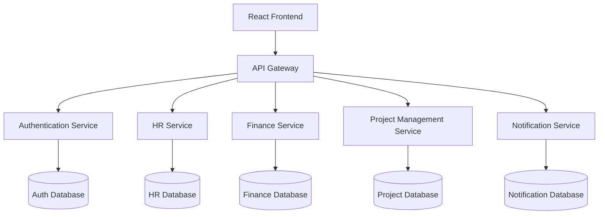
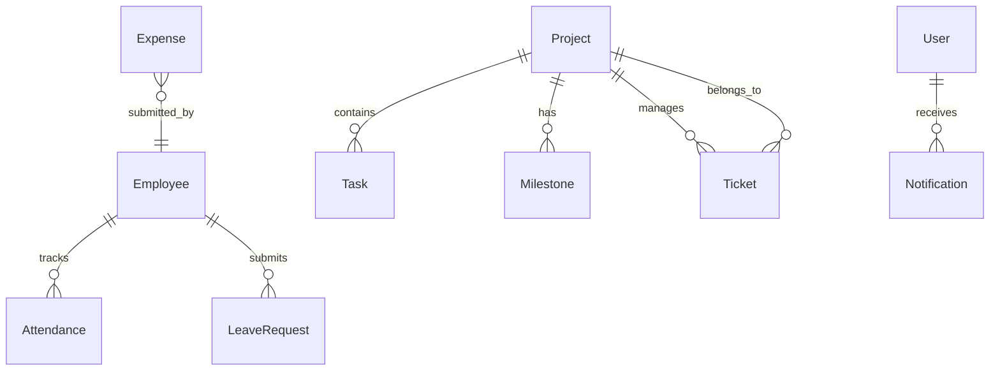
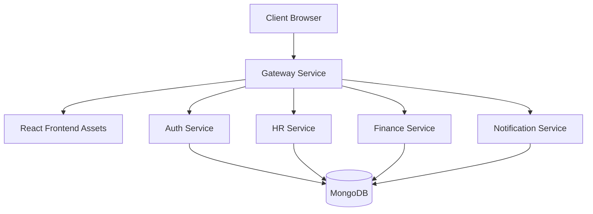

# context

## System Overview
**OrganiStation** is a comprehensive enterprise management platform built on a microservices architecture. The system provides integrated solutions for human resources, finance, project management, and organizational operations through a unified web interface.

### Core Purpose

OrganiStation serves as a centralized platform for managing key organizational functions:

- **Human Resources Management**: Employee records, attendance tracking, leave requests, and job postings
- **Financial Operations**: Budget management, expense tracking, and invoice processing
- **Project Management**: Project lifecycle management, task assignment, milestone tracking, and support tickets
- **Document Management**: Document ingestion, storage, and intelligent querying through RAG (Retrieval-Augmented Generation) capabilities
- **Communication**: Notification system for broadcasts, emails, and user-specific alerts

### System Architecture

The platform follows a microservices architecture pattern with the following key components:

### Key Features

- **Unified Authentication**: Centralized user management with role-based access control
- **RESTful API Design**: Consistent API patterns across all services
- **Real-time Notifications**: Multi-channel notification system (email, broadcast, user-specific)
- **Document Intelligence**: RAG-powered document querying and management
- **Comprehensive CRUD Operations**: Full lifecycle management for all business entities
- **Health Monitoring**: Built-in health checks and service monitoring endpoints

### Business Entities

The system manages several core business entities:

| Domain | Entities | Key Operations |
|--------|----------|----------------|
| HR | Employee, Attendance, LeaveRequest, Job | CRUD, attendance tracking, leave management |
| Finance | Budget, Expense, Invoice | CRUD, financial reporting, expense approval |
| Projects | Project, Task, Ticket, Milestone | CRUD, task assignment, progress tracking |
| System | User, Role, Document, Notification | Authentication, document ingestion, messaging |

scalability benefits of microservices architecture.

## Domain Model
The OrganiStation system is built around several core business domains

### Core Business Entities

#### Human Resources Domain
- **Employee**: Central entity with properties for contact information (email, phone), department assignment, and leave balances (annual_total, sick_total, sick_used)
- **Attendance**: Tracks employee check-in/check-out times with status tracking
- **LeaveRequest**: Manages employee leave requests with type, reason, date ranges, and approval status
- **Job**: Handles job postings with department, type, status, and posting dates

#### Project Management Domain
- **Project**: Core project entity with ownership, priority, status, and timeline management
- **Task**: Individual work items with assignee, priority, due dates, and completion status
- **Milestone**: Project checkpoints with completion tracking and due dates
- **Ticket**: Support and issue tracking with project association, reporter, and priority levels

#### Financial Domain
- **Budget**: Financial planning entity organized by department, period, and fiscal year
- **Invoice**: Client billing with status tracking, amounts, and due date management
- **Expense**: Expense tracking with categorization, approval status, and submitter information

#### Document & Communication Domain
- **Document**: File management with hash-based identification for integrity
- **Notification**: Multi-channel communication supporting broadcast, email, and user-specific messaging

### Security & Access Control
- **User**: Authentication entity with registration, login, and profile management
- **Role**: Authorization entity with permission assignment capabilities
- **Permission**: Granular access control for system resources

### Key Entity Relationships

### Domain Responsibilities

**HR Service**: Manages employee lifecycle, attendance tracking, leave management, and job postings

**Project Management Service**: Handles project planning, task assignment, milestone tracking, and issue resolution

**Finance Service**: Oversees budgeting, and expense management with approval workflows

**Auth Service**: Provides authentication, authorization, and user management with role-based access control

**Notification Service**: Delivers multi-channel communications including email, broadcast, and targeted user notifications

**Gateway Service**: Routes requests and serves frontend assets, acting as the system's entry point

supporting the microservices architecture pattern.

## API Inventory
The OrganiStation platform exposes a comprehensive REST API across multiple microservices. The API follows RESTful conventions with consistent resource-based endpoints.

### Core Resource APIs

#### Document Management
- `GET /api/documents` - List all documents
- `GET /api/documents/view/{doc_hash}` - View specific document by hash
- `DELETE /api/documents/{doc_hash}` - Delete document by hash
- `DELETE /documents/{doc_hash}` - Alternative document deletion endpoint
- `POST /ingest` - Ingest new documents into the system
- `POST /api/query` - Query documents using RAG pipeline
- `POST /query` - Alternative document query endpoint

#### Employee Management
- `GET /api/employees` - List all employees
- `GET /api/employees/{eid}` - Get specific employee by ID
- `PUT /api/employees/{eid}` - Update employee information
- `DELETE /api/employees/{eid}` - Delete employee by ID
- `GET /api/employees/{eid}/attendance` - Get employee attendance records
- `POST /api/attendance` - Record attendance entry

#### Project Management
- `GET /api/projects` - List all projects
- `GET /api/projects/{pid}` - Get specific project by ID
- `PUT /api/projects/{pid}` - Update project information
- `DELETE /api/projects/{pid}` - Delete project by ID
- `GET /api/projects/{pid}/tasks` - List project tasks
- `POST /api/projects/{pid}/tasks` - Create new task in project
- `PUT /api/tasks/{tid}` - Update task information
- `GET /api/projects/{pid}/milestones` - List project milestones

#### Financial Management
- `GET /api/budgets` - List all budgets
- `GET /api/expenses` - List all expenses
- `PUT /api/expenses/{eid}` - Update expense information
- `DELETE /api/expenses/{eid}` - Delete expense by ID
- `GET /api/invoices` - List all invoices
- `PUT /api/invoices/{iid}` - Update invoice information
- `DELETE /api/invoices/{iid}` - Delete invoice by ID

#### Ticket Management
- `GET /api/tickets` - List all tickets
- `POST /api/tickets` - Create new ticket
- `PUT /api/tickets/{tid}` - Update ticket information
- `DELETE /api/tickets/{tid}` - Delete ticket by ID

#### Human Resources
- `GET /api/jobs` - List job postings
- `GET /api/leaves` - List leave requests
- `PUT /api/leaves/{lid}` - Update leave request

### Authentication & Authorization
- `POST /register` - User registration
- `POST /login` - User authentication
- `GET /me` - Get current user information
- `PUT /{user_id}` - Update user information
- `DELETE /{user_id}` - Delete user account
- `POST /roles` - Create new role
- `PUT /roles/{role_name}` - Update role permissions
- `GET /permissions` - List available permissions

### Notification Services
- `POST /notifications/broadcast` - Send broadcast notifications
- `POST /notifications/send-email` - Send email notifications
- `POST /notifications/user/{userId}` - Send user-specific notifications

### System Operations
- `GET /api/health` - API health check
- `GET /api/auth/health` - Authentication service health check
- `GET /api/summary` - System summary information
- `GET /` - Root endpoint
- `DELETE /` - Root deletion operation
- `GET *` - Catch-all handler for unmatched routes

### API Characteristics
- **RESTful Design**: Follows REST conventions with resource-based URLs
- **Consistent Patterns**: Uses standard HTTP methods (GET, POST, PUT, DELETE)
- **Hash-based Identification**: Documents use hash identifiers for security
- **ID-based Resources**: Most resources use numeric or string IDs
- **Health Monitoring**: Dedicated health check endpoints for service monitoring
- **Multi-service Architecture**: APIs distributed across specialized microservices

## Data Flows
### Request Processing Flow

The OrganiStation system follows a structured request processing flow through its microservices architecture:

```mermaid
flowchart TD
    A[Frontend Client] --> B[Gateway]
    B --> C{Route Analysis}
    C -->|/api/auth/*| D[Auth Service]
    C -->|/api/employees/*| E[HR Service]
    C -->|/api/projects/*| E
    C -->|/api/budgets/*| F[Finance Service]
    C -->|/api/expenses/*| F
    C -->|/api/invoices/*| F
    C -->|/notifications/*| G[Notification Service]
    C -->|Static Assets| H[Frontend Assets]
    
    D --> I[Database]
    E --> I
    F --> I
    G --> I
```

### Core Entity Relationships

The system maintains several key data relationships that drive processing flows:

- **Employee-Centric Flows**: Attendance records and leave requests reference employees via `employee_id`, enabling employee-specific data retrieval through endpoints like `/api/employees/{eid}/attendance`
- **Project-Task Hierarchy**: Projects contain tasks and milestones, accessible through nested endpoints (`/api/projects/{pid}/tasks`, `/api/projects/{pid}/milestones`)
- **Ticket-Project Association**: Support tickets reference projects via `project_id` for project-specific issue tracking

### Update Processing Pattern

The system implements a consistent update flow using dedicated update classes:

- `InvoiceUpdate` → `Invoice` entities
- `ExpenseUpdate` → `Expense` entities  
- `TaskUpdate` → `Task` entities
- `TicketUpdate` → `Ticket` entities
- `LeaveUpdate` → `LeaveRequest` entities

### Authentication Flow

User authentication follows a token-based flow:

1. **Login**: `POST /login` authenticates credentials
2. **Token Management**: `POST /refresh` handles token renewal
3. **Session Management**: `POST /logout` terminates sessions
4. **User Context**: `GET /me` retrieves current user information

### Notification Distribution

The notification service supports multiple distribution patterns:

- **Broadcast**: `POST /notifications/broadcast` sends to all users
- **Targeted**: `POST /notifications/user/{userId}` sends to specific users
- **Email**: `POST /notifications/send-email` handles email notifications

### Document Processing Flow

1. **Ingestion**: `POST /ingest` processes new documents
2. **Storage**: Documents stored with hash-based identifiers
3. **Retrieval**: `GET /api/documents/view/{doc_hash}` serves original files
4. **Query**: `POST /api/query` enables document search
5. **Management**: `DELETE /api/documents/{doc_hash}` removes documents

## External Integrations
OrganiStation integrates with several external systems and services to provide comprehensive business management functionality.

### Database Systems

The system utilizes relational database storage with the following key entity relationships:

- **Employee Management**: Attendance records and leave requests are linked to employees via `employee_id` references
- **Project Management**: Tickets are associated with projects through `project_id` relationships
- **Financial Tracking**: Invoice and expense records maintain referential integrity through dedicated update classes

### Messaging and Notifications

The notification service provides multiple communication channels:

- **Email Notifications**: Direct email sending capabilities via `/notifications/send-email` endpoint
- **User-Targeted Messages**: Individual user notifications through `/notifications/user/{userId}`
- **Broadcast Communications**: System-wide announcements via `/notifications/broadcast`

### Authentication Services

- **Health Monitoring**: Authentication service health checks at `/api/auth/health`
- **Token Management**: JWT token refresh capabilities through `/refresh` endpoint
- **Role-Based Access**: Permission and role management systems with dedicated response schemas

### Document Management

- **Document Ingestion**: File upload and processing via `/ingest` endpoint
- **Document Querying**: Search and retrieval through `/api/query` interface
- **File Serving**: Direct document access via `/api/documents/view/{doc_hash}`

### API Gateway Integration

The gateway service coordinates external access:

- **Frontend Asset Serving**: Static file delivery through compiled asset management
- **Service Routing**: API endpoint routing to corresponding microservice functions
- **Health Monitoring**: System-wide health checks via `/api/health`

health monitoring to ensure system reliability, data consistency.

## User Journeys
### End User Journeys

#### Employee Self-Service Journey
1. **Authentication**: User logs in through the frontend authentication system
2. **Dashboard Access**: Navigate to personal dashboard with role-based permissions
3. **Attendance Management**: Clock in/out using attendance tracking endpoints
4. **Leave Requests**: Submit and track leave requests through HR service
5. **Expense Submission**: Create and submit expense reports for approval
6. **Document Access**: View and download documents through document management system

#### Manager Workflow Journey
1. **Team Overview**: Access employee lists and attendance records
2. **Approval Workflows**: Review and approve leave requests and expense submissions
3. **Project Management**: Create projects, assign tasks, and track milestones
4. **Budget Oversight**: Monitor departmental budgets and financial reports
5. **Ticket Management**: Handle support tickets and issue resolution

#### HR Administrator Journey
1. **Employee Lifecycle**: Manage employee onboarding, updates, and offboarding
2. **Attendance Monitoring**: Track employee attendance patterns and generate reports
3. **Leave Management**: Process leave requests and maintain leave balances
4. **Job Posting**: Create and manage job postings for recruitment
5. **Compliance Reporting**: Generate HR reports and maintain employee records

#### Finance Team Journey
1. **Invoice Processing**: Create, update, and track invoice statuses
2. **Expense Management**: Review and process employee expense submissions
3. **Budget Planning**: Create and manage departmental budgets by period
4. **Financial Reporting**: Generate financial reports and analytics
5. **Vendor Management**: Handle client billing and payment tracking

### Developer Journeys

#### API Integration Journey
1. **Service Discovery**: Identify required microservice endpoints through API gateway
2. **Authentication Setup**: Implement JWT-based authentication with auth service
3. **Data Operations**: Integrate CRUD operations for business entities (employees, projects, invoices)
4. **Error Handling**: Implement proper error handling for service communication
5. **Testing**: Validate API integrations using health check endpoints

#### Frontend Development Journey
1. **Component Setup**: Utilize React components with authentication context
2. **State Management**: Implement state management for user sessions and data
3. **API Communication**: Connect frontend to backend services through gateway
4. **User Experience**: Build responsive interfaces for different user roles
5. **Deployment**: Deploy frontend assets through gateway public asset serving

#### Microservice Development Journey
1. **Service Architecture**: Design new microservices following existing patterns
2. **Database Integration**: Implement MongoDB connections using configuration settings
3. **API Design**: Create RESTful endpoints following established conventions
4. **Service Communication**: Implement inter-service communication with proper authentication
5. **Monitoring**: Add health check endpoints and logging for service observability

### Document and Knowledge Management Journey
1. **Document Ingestion**: Upload documents through RAG pipeline for processing
2. **Content Indexing**: Documents are processed and indexed for searchability
3. **Query Processing**: Users can query documents using natural language
4. **Document Retrieval**: Access original documents through hash-based identification
5. **Knowledge Discovery**: Leverage RAG capabilities for intelligent document search

### Notification and Communication Journey
1. **Event Triggers**: System events trigger notification workflows
2. **Multi-Channel Delivery**: Notifications sent via email, broadcast, or user-specific channels
3. **User Preferences**: Users can manage notification preferences and delivery methods
4. **Status Tracking**: Monitor notification delivery and user engagement
5. **Integration Points**: Notifications integrate with all business processes (approvals, updates, alerts)

## Deployment Notes
### Runtime Topology

The OrganiStation system follows a microservices deployment pattern with the following runtime layout:

### Service Communication

- **Gateway Service**: Acts as the entry point, serving static frontend assets and routing API requests
- **Internal Service Communication**: Services communicate using `INTERNAL_SERVICE_SECRET` for authentication
- **Database Layer**: All services connect to MongoDB using `MONGODB_URI` configuration

### Runtime Configuration

| Variable | Purpose | Services |
|----------|---------|----------|
| `PORT` | Service port binding | All services |
| `HOST` | Service host binding | All services |
| `MONGODB_URI` | Database connection | All services |
| `JWT_SECRET` | Token signing/verification | Auth, Gateway |
| `INTERNAL_SERVICE_SECRET` | Inter-service authentication | All services |
| `FINANCE_SERVICE_URL` | Finance service endpoint | Gateway, other services |

### Deployment Considerations

API routing, management
- Inter-service authentication ensures secure communication within the deployment environment
