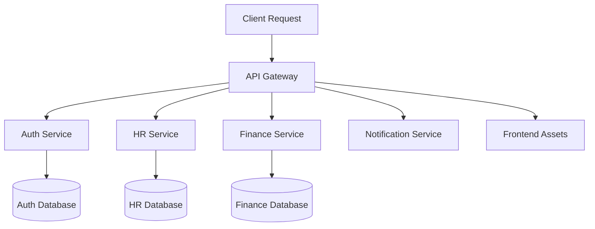
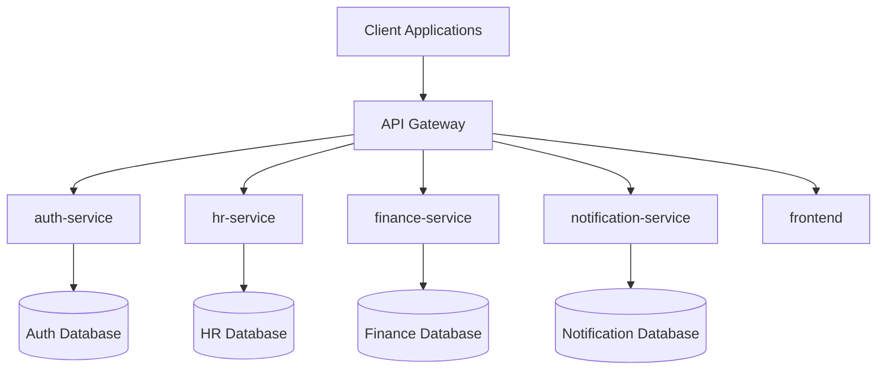

# context

## System Overview
OrganiStation is a comprehensive enterprise management platform built on a microservices architecture. The system provides integrated solutions for human resources, finance, project management, and document handling through a unified web interface.

### Core Purpose

OrganiStation serves as a centralized platform for organizations to manage their key business operations including:

- **Human Resources Management**: Employee records, attendance tracking, leave requests, and HR workflows
- **Financial Operations**: Budget management, expense tracking, invoice processing, and financial reporting
- **Project Management**: Project lifecycle management, task assignment, milestone tracking, and ticket management
- **Document Management**: Document storage, retrieval, and intelligent querying with RAG (Retrieval-Augmented Generation) capabilities
- **User Management**: Authentication, authorization, role-based access control, and user administration
- **Notification System**: Multi-channel communication including email notifications and system broadcasts

### System Architecture

- **Gateway Service**: Central API gateway handling routing and public asset serving
- **Frontend Application**: React-based web interface with authentication context management
- **Authentication Service**: Dedicated service for user authentication, role management, and permissions
- **HR Service**: Human resources functionality including employee management and attendance tracking
- **Finance Service**: Financial operations including budget and expense management
- **Project Management Service**: Project lifecycle, task management, and ticketing system
- **Notification Service**: Multi-channel notification delivery and broadcasting

### Key Features

- **Multi-tenant Architecture**: Support for organizational hierarchies and departmental structures
- **Role-based Access Control**: Granular permissions system with configurable roles
- **RESTful API Design**: Standardized API endpoints across all services
- **Document Intelligence**: AI-powered document querying and content retrieval
- **Real-time Notifications**: Instant updates and communication across the platform
- **Comprehensive Reporting**: Financial summaries, project status, and operational metrics

## Domain Model
### Core Business Entities

#### Human Resources Domain
- **Employee**: Core entity with properties for hire_date, email, status, and leave tracking (wfh_used, wfh_total, sick_total)
- **Attendance**: Tracks daily employee presence with check_in, check_out, date, and status
- **LeaveRequest**: Manages employee time off with start_date, end_date, type, reason, and approval status

#### Project Management Domain
- **Project**: Central project entity with owner, priority, description, status, due_date, and start_date
- **Task**: Individual work items with status, priority, title, description, due_date, and assignee
- **Ticket**: Support/issue tracking with priority, reporter, status, title, project_id, and assignee

#### Financial Management Domain
- **Budget**: Financial planning entity with year, amount, department, month, period, and notes
- **Invoice**: Client billing with description, due_date, client_name, amount, and status
- **Expense**: Cost tracking with date, category, amount, title, status, and notes

#### Document Management Domain
- **Document**: File management entity identified by hash-based system for secure document handling

#### Authentication & Authorization Domain
- **User**: System user entity with user_id identification
- **TokenPayload**: JWT structure with exp, permissions, role, and sub properties

### Entity Relationships

#### Primary Associations
- **Tickets → Projects**: Tickets belong to projects via project_id property
- **LeaveRequest → Employee**: Leave requests are associated with employees via employee_id
- **Attendance → Employee**: Attendance records track individual employees via employee_id
- **Projects → Tasks**: Projects contain multiple tasks accessible via project relationships
- **Projects → Milestones**: Projects include milestone tracking for progress management

### Domain Responsibilities

#### Employee Management
- Track employee information, attendance, and leave requests
- Manage work-from-home and sick leave allocations
- Monitor daily check-in/check-out activities

#### Project Coordination
- Organize projects with tasks and milestones
- Track project status, priorities, and deadlines
- Manage ticket assignment and resolution

#### Financial Operations
- Budget planning and departmental allocation
- Invoice generation and client billing
- Expense tracking and categorization

#### Document Processing
- Secure document storage with hash-based identification
- Document retrieval and viewing capabilities
- Integration with RAG pipeline for document querying

### Service Integration

The domain model is distributed across specialized services:
- **hr-service**: Manages Employee, Attendance, and LeaveRequest entities
- **finance-service**: Handles Budget, Invoice, and Expense operations
- **project-management-service**: Coordinates Project, Task, and Ticket workflows
- **auth-service**: Manages User authentication and authorization
- **gateway**: Provides unified API access and frontend asset serving

## API Inventory
The OrganiStation system exposes a comprehensive REST API across multiple microservices. The following endpoints are available:

### Document Management
- `GET /api/documents` - Retrieve list of documents
- `GET /api/documents/view/{doc_hash}` - View specific document by hash
- `DELETE /api/documents/{doc_hash}` - Delete document by hash
- `POST /api/query` - Query documents using RAG pipeline
- `POST /ingest` - Ingest new documents into the system
- `POST /api/reset` - Reset document database

### Employee Management
- `GET /api/employees` - List all employees
- `GET /api/employees/{eid}` - Get specific employee by ID
- `PUT /api/employees/{eid}` - Update employee information
- `DELETE /api/employees/{eid}` - Delete employee record
- `GET /api/employees/{eid}/attendance` - Get employee attendance records
- `POST /api/attendance` - Record attendance entry

### Project Management
- `GET /api/projects` - List all projects
- `GET /api/projects/{pid}` - Get specific project by ID
- `PUT /api/projects/{pid}` - Update project information
- `DELETE /api/projects/{pid}` - Delete project
- `GET /api/projects/{pid}/milestones` - Get project milestones
- `GET /api/projects/{pid}/tasks` - Get project tasks
- `POST /api/projects/{pid}/tasks` - Create new task in project
- `PUT /api/tasks/{tid}` - Update task information

### Financial Management
- `GET /api/budgets` - List budgets
- `POST /api/budgets` - Create new budget
- `GET /api/expenses` - List expenses
- `POST /api/expenses` - Create new expense
- `PUT /api/expenses/{eid}` - Update expense record
- `DELETE /api/expenses/{eid}` - Delete expense
- `GET /api/invoices` - List invoices
- `PUT /api/invoices/{iid}` - Update invoice
- `DELETE /api/invoices/{iid}` - Delete invoice

### Ticket Management
- `GET /api/tickets` - List support tickets
- `POST /api/tickets` - Create new ticket
- `PUT /api/tickets/{tid}` - Update ticket
- `DELETE /api/tickets/{tid}` - Delete ticket

### Authentication & Authorization
- `POST /login` - User authentication
- `POST /logout` - User logout
- `POST /register` - User registration
- `POST /refresh` - Token refresh
- `POST /change-password` - Change user password
- `GET /{user_id}` - Get user information
- `PUT /{user_id}` - Update user information
- `DELETE /{user_id}` - Delete user
- `POST /roles` - Create new role
- `PUT /roles/{role_name}` - Update role permissions

### Notifications
- `POST /notifications/broadcast` - Broadcast notifications
- `POST /notifications/send-email` - Send email notifications
- `POST /notifications/user/{userId}` - Send notification to specific user

### System Operations
- `GET /api/health` - API health check
- `GET /api/auth/health` - Authentication service health
- `GET /api/summary` - System summary information
- `PUT /api/leaves/{lid}` - Update leave requests

### Leave Management
- `PUT /api/leaves/{lid}` - Update leave request status

All endpoints follow RESTful conventions with appropriate HTTP methods for CRUD operations. Path parameters are used for resource identification (e.g., `{eid}` for employee ID, `{pid}` for project ID, `{doc_hash}` for document hash).

## Data Flows
### Request Processing Flows

The OrganiStation system processes requests through several key data flows:

#### Client-Gateway-Service Flow

#### Authentication Flow
- **Login**: `POST /login` → Auth service validates credentials
- **Registration**: `POST /register` → Auth service creates new user
- **Password Change**: `POST /change-password` → Auth service updates credentials
- **Token Refresh**: `POST /refresh` → Auth service issues new tokens
- **Logout**: `POST /logout` → Auth service invalidates session

#### Employee Management Flow
- **Employee Creation**: `POST /api/employees` → HR service creates employee record
- **Employee Retrieval**: `GET /api/employees/{eid}` → HR service returns employee data
- **Attendance Logging**: `POST /api/attendance` → HR service records attendance
- **Attendance Retrieval**: `GET /api/employees/{eid}/attendance` → HR service returns attendance records

#### Project Management Flow
- **Project Listing**: `GET /api/projects` → Project service returns all projects
- **Project Details**: `GET /api/projects/{pid}` → Project service returns specific project
- **Task Management**: 
  - `GET /api/projects/{pid}/tasks` → Retrieve project tasks
  - `POST /api/projects/{pid}/tasks` → Create new task in project
- **Milestone Tracking**: `GET /api/projects/{pid}/milestones` → Retrieve project milestones

#### Document Processing Flow
- **Document Ingestion**: `POST /ingest` → Document service processes and stores documents
- **Document Retrieval**: `GET /api/documents` → Document service returns document list
- **Document Viewing**: `GET /api/documents/view/{doc_hash}` → Document service serves original files
- **Document Querying**: `POST /api/query` → Document service searches document content
- **Document Deletion**: `DELETE /api/documents/{doc_hash}` → Document service removes documents

#### Notification Flow
- **User Notifications**: `POST /notifications/user/{userId}` → Notification service sends targeted messages
- **Broadcast Messages**: `POST /notifications/broadcast` → Notification service sends system-wide alerts
- **Email Notifications**: `POST /notifications/send-email` → Notification service handles email delivery

#### Financial Data Flow
- **Budget Management**: `GET /api/budgets` → Finance service returns budget information
- **Expense Processing**: 
  - Create/Update: `PUT /api/expenses/{eid}` → Finance service manages expense records
  - Delete: `DELETE /api/expenses/{eid}` → Finance service removes expenses
- **Invoice Management**:
  - Update: `PUT /api/invoices/{iid}` → Finance service updates invoice data
  - Delete: `DELETE /api/invoices/{iid}` → Finance service removes invoices

#### System Health and Monitoring
- **Health Checks**: `GET /api/health`, `GET /api/auth/health` → Services report operational status
- **System Summary**: `GET /api/summary` → Aggregated system information
- **Database Reset**: `POST /api/reset` → System maintenance operations

## External Integrations
OrganiStation integrates with several external systems and services to provide comprehensive organizational management capabilities.

### Database Integration

The system maintains relationships between core entities through a relational database structure:

- **Employee-Attendance Relationship**: Attendance records are linked to employees via `employee_id` property
- **Employee-Leave Relationship**: Leave requests are associated with employees through `employee_id` references
- **Project-Ticket Relationship**: Support tickets are organized under projects using `project_id` associations
- **Project Hierarchies**: Projects contain both milestones and tasks, accessible through dedicated endpoints

### API Gateway Integration

The gateway service acts as the central integration point:

- **Frontend Asset Serving**: Gateway serves compiled frontend assets through a public directory structure
- **Static Resource Management**: Contains JavaScript bundles and static assets for web interface delivery
- **Request Routing**: Handles routing between frontend and backend services

### Service Configuration

Multiple services maintain their own configuration management:

- **Authentication Service**: Contains schema models with response configurations for roles, users, and permissions
- **Notification Service**: Includes dedicated configuration settings for email and messaging integrations

### Document Management Integration

The system provides document handling capabilities:

- **Document Ingestion**: POST `/ingest` endpoint for document upload and processing
- **Document Querying**: Multiple query endpoints (`/api/query`, `/query`) for document search
- **File Serving**: Direct document viewing through `/api/documents/view/{doc_hash}` endpoint
- **Document Lifecycle**: Full CRUD operations for document management

### Notification System Integration

Comprehensive notification capabilities:

- **Email Integration**: Dedicated `/notifications/send-email` endpoint for email delivery
- **User Notifications**: Individual user targeting via `/notifications/user/{userId}`
- **Broadcast Messaging**: System-wide notifications through `/notifications/broadcast`

### Health Monitoring

Integrated health check endpoints across services:

- **Authentication Health**: `/api/auth/health` for auth service status
- **General Health**: `/api/health` for overall system status
- **System Summary**: `/api/summary` for comprehensive system information

## User Journeys
### End User Journeys

#### Employee Self-Service Journey
1. **Authentication**: Employee logs in through the auth-service using `/login` endpoint
2. **View Personal Information**: Access employee details via `/api/employees/{eid}`
3. **Track Attendance**: Check attendance records through `/api/employees/{eid}/attendance`
4. **Submit Leave Requests**: Create leave requests using HR service endpoints
5. **View Assigned Tasks**: Access project tasks and tickets assigned to them

#### Manager Workflow Journey
1. **Team Management**: Access employee list via `/api/employees` to manage team members
2. **Project Oversight**: View and manage projects through `/api/projects` and `/api/projects/{pid}`
3. **Task Assignment**: Create and assign tasks using `/api/projects/{pid}/tasks`
4. **Approval Workflows**: Review and update leave requests via `/api/leaves/{lid}`
5. **Performance Tracking**: Monitor team attendance and project progress

#### Finance Team Journey
1. **Budget Management**: Create and monitor budgets through `/api/budgets` endpoints
2. **Expense Processing**: Review and approve expenses via `/api/expenses`
3. **Invoice Management**: Handle client invoices using `/api/invoices` operations
4. **Financial Reporting**: Generate reports from budget and expense data

#### IT Support Journey
1. **Ticket Management**: Handle support requests through `/api/tickets` endpoints
2. **System Maintenance**: Use `/api/reset` for database operations when needed
3. **User Administration**: Manage user accounts and permissions via auth-service
4. **Document Management**: Handle document ingestion via `/ingest` and queries via `/query`

### Developer Journeys

#### API Integration Journey
1. **Service Discovery**: Identify required microservice (auth, hr, finance, project-management, notification)
2. **Authentication Setup**: Implement JWT token handling with TokenPayload structure
3. **Endpoint Integration**: Connect to specific API endpoints based on functionality needs
4. **Error Handling**: Implement proper error handling for service responses
5. **Testing**: Validate integration using health check endpoints like `/api/auth/health`

#### Frontend Development Journey
1. **Component Setup**: Use React App component and AuthProvider context for authentication
2. **State Management**: Implement authentication state using AuthContext
3. **API Communication**: Connect frontend to gateway service for backend communication
4. **User Interface**: Build interfaces for employee, project, finance, and ticket management
5. **Deployment**: Deploy through gateway service with public assets

#### Backend Service Development Journey
1. **Service Architecture**: Follow microservices pattern with dedicated services for each domain
2. **Data Models**: Implement entities like Employee, Project, Invoice, Expense with proper schemas
3. **API Design**: Create RESTful endpoints following established patterns (GET, POST, PUT, DELETE)
4. **Database Integration**: Use proper data models with relationships and constraints
5. **Service Communication**: Implement inter-service communication through gateway routing

#### DevOps Journey
1. **Service Deployment**: Deploy individual microservices (auth, hr, finance, notification, project-management)
2. **Gateway Configuration**: Set up API gateway for request routing and load balancing
3. **Database Management**: Configure databases for each service domain
4. **Monitoring Setup**: Implement health checks and monitoring across all services
5. **Security Configuration**: Set up JWT authentication and role-based permissions

## Deployment Notes
### Service Topology

OrganiStation follows a microservices deployment pattern with the following service layout:

### Runtime Components

| Service | Type | Purpose | Dependencies |
|---------|------|---------|-------------|
| **gateway** | API Gateway | Request routing, public assets | All backend services |
| **frontend** | React App | User interface | gateway, auth-service |
| **auth-service** | Backend Service | Authentication & authorization | Database |
| **hr-service** | Backend Service | HR operations, attendance | Database |
| **finance-service** | Backend Service | Budget management | Database |
| **notification-service** | Backend Service | Notification handling | Database |

### Deployment Considerations

- **Gateway Pattern**: Single entry point for all client requests
- **Service Independence**: Each service can be deployed and scaled independently
- **Authentication Flow**: Centralized through auth-service with role-based permissions
- **Document Management**: Hash-based identification system for document handling
- **RESTful APIs**: Standard HTTP-based communication between services

### Network Flow

1. Client requests enter through the API gateway
2. Gateway routes requests to appropriate backend services
3. Authentication context maintained across service boundaries
4. Each service manages its own data persistence layer
