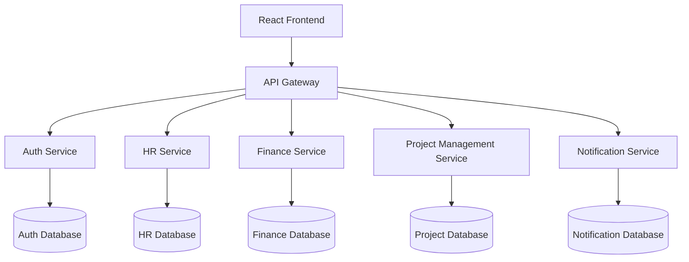
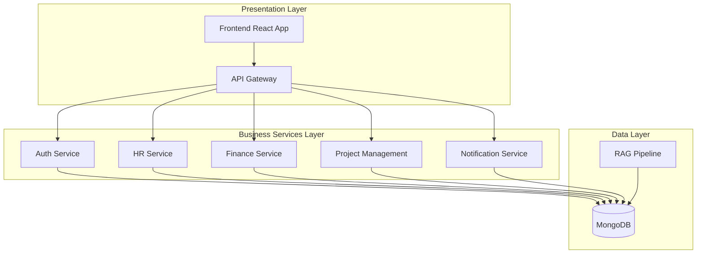
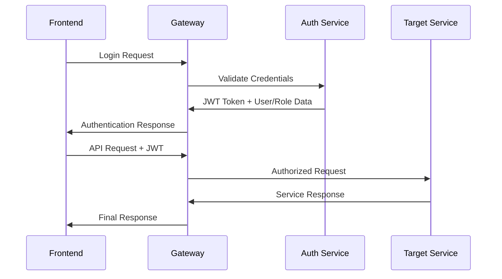
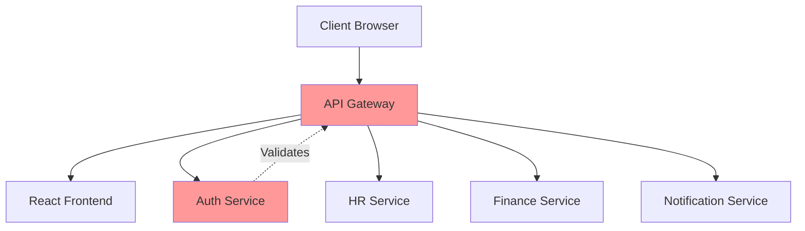
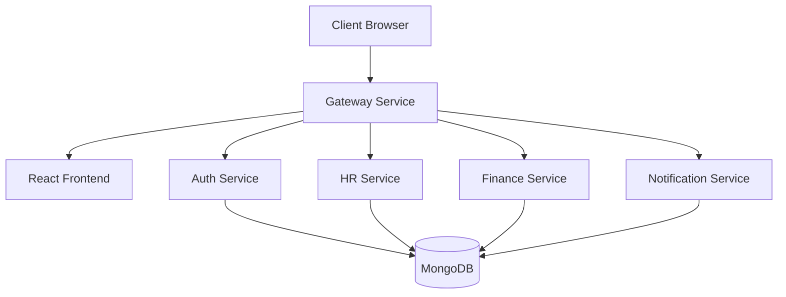
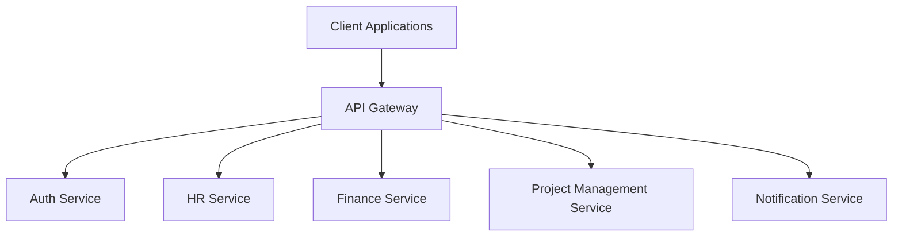

# architecture

## Repository Overview
OrganiStation is a comprehensive organizational management platform built using a microservices architecture. The system provides integrated solutions for human resources, financial management, project tracking, and organizational communication through a unified web interface.

### Purpose

The platform serves as a centralized hub for organizational operations, offering:

- **Human Resources Management**: Employee records, attendance tracking, leave management, and job postings
- **Financial Operations**: Budget management, expense tracking, and invoice processing
- **Project Management**: Project lifecycle management with tasks, milestones, and ticket tracking
- **Document Management**: Centralized document storage with AI-powered query capabilities
- **Communication**: Integrated notification system for organizational updates

### Architecture Approach

OrganiStation implements a microservices architecture pattern with the following key characteristics:

- **API Gateway Pattern**: Centralized routing and frontend asset serving
- **Domain-Driven Design**: Separate services for distinct business domains (auth, hr, finance, notifications)
- **RESTful APIs**: Standardized HTTP-based communication between services
- **React Frontend**: Modern web interface with authentication context management

### Core Components

- **Gateway Service**: Routes API calls and serves frontend assets
- **Authentication Service**: User management, authentication, and authorization
- **HR Service**: Human resources and employee management
- **Finance Service**: Budget and financial operations
- **Notification Service**: Communication and alert management
- **Frontend Application**: React-based user interface

## Architecture Overview
OrganiStation follows a **microservices architecture** with an API gateway pattern, designed to provide scalable enterprise resource planning capabilities.

### System Design Philosophy

- **Domain-driven design**: Each service owns a specific business domain (HR, Finance, Projects, etc.)
- **Service autonomy**: Services operate independently with their own data models, business logic, and data layers

### High-Level Architecture



### Core Components

#### API Gateway
- **Purpose**: Single entry point for all client requests
- **Responsibilities**: 
  - Routes API calls to appropriate microservices
  - Serves compiled frontend assets
  - Handles cross-cutting concerns (authentication, logging)
- **Technology**: Serves static assets and proxies API requests

#### Frontend Application
- **Technology**: React with authentication context
- **Architecture**: Single-page application (SPA)
- **Key Components**:
  - `App` component as main application entry point
  - `AuthProvider` for authentication state management
  - Context-based state management

#### Microservices

**Authentication Service**
- Manages user authentication and authorization
- Provides response schemas for users, roles, and permissions
- Handles user registration, login, and role management

**HR Service** 
- Employee lifecycle management
- Attendance tracking with check-in/check-out functionality
- Leave request processing
- Job posting management

**Finance Service**
- Budget management with departmental allocation
- Invoice processing and tracking
- Expense management and approval workflows

**Project Management Service**
- Project lifecycle management
- Task assignment and tracking
- Milestone management
- Support ticket system

**Notification Service**
- Multi-channel notification delivery
- Email notifications
- User-targeted and broadcast messaging

### Architectural Patterns

#### Resource-Based API Design
All services follow RESTful conventions with resource-based URLs:
- `/api/employees/{eid}` - Employee resources
- `/api/projects/{pid}/tasks` - Nested task resources
- `/api/documents/{doc_hash}` - Hash-based document identification

#### Domain Entity Relationships
- **Employee ← Attendance**: One-to-many relationship via `employee_id`
- **Employee ← LeaveRequest**: One-to-many relationship via `employee_id`
- **Project ← Task**: One-to-many containment relationship
- **Project ← Ticket**: One-to-many reference via `project_id`

#### Configuration Management
Centralized configuration through `Settings` classes:
- Database connection strings (MongoDB)
- Service URLs and ports
- Security secrets (JWT, internal service authentication)
- Environment-specific settings

### Data Flow Architecture

1. **Client Request Flow**:
   - Frontend → Gateway → Microservice → Database
   - Response follows reverse path with appropriate transformations

2. **Inter-Service Communication**:
   - Services communicate via HTTP APIs
   - Internal service authentication using shared secrets
   - Asynchronous notifications through notification service

3. **Document Management**:
   - RAG (Retrieval-Augmented Generation) pipeline for document processing
   - Hash-based document identification for integrity
   - Query capabilities for document search and retrieval

### Scalability Considerations

service discovery

## High-Level Design
OrganiStation follows a microservices architecture pattern with clear separation of concerns across functional domains. The system is organized into distinct subsystems with well-defined boundaries

### Core Subsystems

#### Presentation Layer
- **Frontend Service**: React-based single-page application providing the user interface
- **Gateway Service**: API gateway that serves frontend assets and routes API requests

#### Business Logic Layer
- **Authentication Service**: Handles user authentication, authorization, roles, and permissions
- **HR Service**: Manages employee data, attendance tracking, and leave requests
- **Finance Service**: Processes budgets, expenses, and invoices
- **Project Management Service**: Coordinates projects, tasks, tickets, and milestones
- **Notification Service**: Handles system-wide notifications and email communications

#### Data Layer
- **Document Management**: RAG pipeline for document ingestion and querying
- **Database Services**: MongoDB-based persistence across services

### Service Boundaries

- **HR Domain**: Employee, Attendance, LeaveRequest entities
- **Finance Domain**: Budget, Invoice, Expense entities
- **Project Domain**: Project, Task, Ticket, Milestone entities
- **Auth Domain**: User, Role, Permission entities
- **Document Domain**: Document ingestion and retrieval
- **Communication Domain**: Notification broadcasting and delivery

### Architectural Layering



### Cross-Cutting Concerns

- **Security**: JWT-based authentication handled by auth service
- **Configuration**: Centralized settings management with environment-specific configurations
- **Inter-Service Communication**: RESTful APIs with standardized response schemas
- **Asset Management**: Static frontend assets served through gateway public directory

## Component Design
### Core Components

#### Gateway Service
**Responsibilities:**
- API routing and request forwarding
- Frontend asset serving (React application)
- Cross-cutting concerns handling

**Key Features:**
- Serves compiled frontend assets through `index-DuQXh1_U.js`
- Routes API calls to appropriate microservices
- Acts as single entry point for client requests

#### Authentication Service
**Responsibilities:**
- User authentication and authorization
- Role and permission management
- JWT token handling

**Key Components:**
- `UserResponse` schema for user data serialization
- `RoleResponse` schema for role management
- `PermissionResponse` schema for permission handling

#### HR Service
**Responsibilities:**
- Employee lifecycle management
- Attendance tracking
- Leave request processing

**Key Components:**
- `Employee` entity with department, contact, and leave balance properties
- `Attendance` class for check-in/check-out tracking
- `LeaveRequest` entity for time-off management

#### Finance Service
**Responsibilities:**
- Budget management and tracking
- Invoice processing
- Expense management

**Key Components:**
- `Budget` entity with period, department, and amount tracking
- `Invoice` entity with client, status, and payment management
- `Expense` entity with category, status, and approval workflow

#### Project Management Service
**Responsibilities:**
- Project lifecycle management
- Task assignment and tracking
- Milestone management
- Issue/ticket handling

**Key Components:**
- `Project` entity with owner, priority, and status tracking
- `Task` entity with assignee, priority, and due date management
- `Ticket` entity for issue tracking and resolution
- `Milestone` entity for project checkpoint management

#### Notification Service
**Responsibilities:**
- Multi-channel notification delivery
- User-targeted messaging
- Email communication

**Key Features:**
- Broadcast notifications to all users
- User-specific notification targeting
- Email notification capabilities
- Configurable settings through `Settings` class

#### RAG Pipeline Service
**Responsibilities:**
- Document ingestion and processing
- Query processing and response generation
- Knowledge retrieval and augmentation

**Key Features:**
- Document management with hash-based identification
- Query processing capabilities
- Integration with document storage and retrieval

### Component Interactions

#### Frontend-Gateway Integration
- React application (`App` component) served through gateway
- Authentication context (`AuthProvider`) manages user sessions
- All API requests routed through gateway endpoint

#### Service-to-Service Dependencies
- Projects contain Tasks and Milestones (composition relationship)
- Employees have Attendance records and LeaveRequests (aggregation)
- Tickets reference Projects for context and organization
- Users receive targeted Notifications through notification service

#### Data Entity Relationships
- `Attendance` → `Employee` (via employee_id)
- `LeaveRequest` → `Employee` (via employee_id)
- `Ticket` → `Project` (via project_id)
- Update entities provide modification capabilities for core entities

### Configuration Management

#### Settings Configuration
**Application Settings:**
- `PORT` and `HOST` for service binding
- `MONGODB_URI` for database connectivity
- `JWT_SECRET` for authentication
- `INTERNAL_SERVICE_SECRET` for inter-service communication
- `FINANCE_SERVICE_URL` for service discovery

#### Service-Specific Configuration
- Auth service: Response schema configurations
- Notification service: Delivery and routing settings
- Each service maintains isolated configuration management

## Runtime Design
### Request Lifecycle

The OrganiStation system follows a standard microservices request lifecycle pattern:

1. **Client Request**: Frontend applications send HTTP requests to the API gateway
2. **Gateway Routing**: The gateway routes requests to appropriate microservices based on URL patterns
3. **Service Processing**: Individual services handle business logic and data operations
4. **Response Assembly**: Services return responses through the gateway back to clients

### Execution Flows

#### Authentication Flow
- Login requests (`POST /login`) are processed by the auth-service
- Token refresh operations (`POST /refresh`) maintain session state
- Protected endpoints validate tokens before processing requests
- User management operations (create, update, delete) flow through auth-service

#### CRUD Operation Flows
The system implements consistent CRUD patterns across all entities:

**Create Operations**:
- `POST /api/{resource}` → Service validation → Database insertion → Response
- Nested resource creation (e.g., `POST /api/projects/{pid}/tasks`) maintains parent-child relationships

**Read Operations**:
- `GET /api/{resource}` → Service query → Data retrieval → Response formatting
- Relationship queries (e.g., `GET /api/employees/{eid}/attendance`) follow foreign key associations

**Update Operations**:
- `PUT /api/{resource}/{id}` → Validation → Database update → Response
- Dedicated update classes (InvoiceUpdate, ExpenseUpdate, TaskUpdate, TicketUpdate, LeaveUpdate) handle entity modifications

**Delete Operations**:
- `DELETE /api/{resource}/{id}` → Authorization check → Cascade handling → Database deletion

#### Notification Flow
- Broadcast notifications (`POST /notifications/broadcast`) distribute to all users
- Targeted notifications (`POST /notifications/user/{userId}`) route to specific users
- Email notifications (`POST /notifications/send-email`) integrate with external email services

### Concurrency Model

#### Service-Level Concurrency
- Each microservice (auth, hr, finance, notification) operates independently
- Services can scale horizontally without affecting other components
- Database connections are managed per service to avoid resource contention

#### Request Handling
- The gateway serves as a single entry point, managing concurrent client connections
- Static asset serving (`GET *`) is handled separately from API requests for optimal performance
- Health check endpoints (`GET /api/health`, `GET /api/auth/health`) provide service availability monitoring

#### Data Consistency
- Entity relationships (Employee→Attendance, Project→Task, Ticket→Project) maintain referential integrity
- Update operations use dedicated update classes to ensure atomic modifications
- Cross-service operations coordinate through the gateway layer

### Error Handling
- Services implement consistent error response formats
- The gateway handles service unavailability and routing failures
- Database reset functionality (`POST /api/reset`) provides system recovery capabilities

## Integration Design
### API Gateway Pattern

OrganiStation implements an API Gateway pattern where the gateway service acts as the central entry point for all client requests. The gateway serves dual purposes:

- **Frontend Asset Serving**: Delivers compiled React application assets through the public directory
- **API Request Routing**: Routes API calls to appropriate microservices based on path patterns

### Service Communication

The system uses RESTful APIs for inter-service communication with the following integration patterns:

#### Microservice Endpoints

**Authentication Service**
- Health check: `GET /api/auth/health`
- User management: `POST /register`, `POST /login`, `POST /logout`
- Token management: `POST /refresh`
- Role/Permission management: `GET /roles`, `POST /roles`, `PUT /roles/{role_name}`

**HR Service**
- Employee management: `GET /api/employees`, `POST /api/employees`, `PUT /api/employees/{eid}`
- Attendance tracking: `POST /api/attendance`, `GET /api/employees/{eid}/attendance`
- Leave management: `GET /api/leaves`, `PUT /api/leaves/{lid}`

**Finance Service**
- Budget management: `GET /api/budgets`, `POST /api/budgets`
- Expense tracking: `GET /api/expenses`, `POST /api/expenses`, `PUT /api/expenses/{eid}`
- Invoice management: `GET /api/invoices`, `PUT /api/invoices/{iid}`

**Notification Service**
- Broadcast notifications: `POST /notifications/broadcast`
- User-specific notifications: `POST /notifications/user/{userId}`
- Email notifications: `POST /notifications/send-email`

### Data Integration Patterns

#### Entity Relationships
- **Employee-Attendance**: Attendance records reference employees via `employee_id`
- **Employee-Leave**: Leave requests reference employees via `employee_id`
- **Project-Task**: Tasks belong to projects via `project_id`
- **Project-Milestone**: Projects contain milestones accessible via project endpoints

#### Update Operations
The system implements dedicated update classes for entity modifications:
- `InvoiceUpdate` for invoice modifications
- `ExpenseUpdate` for expense modifications
- `TaskUpdate` for task modifications
- `TicketUpdate` for ticket modifications
- `LeaveUpdate` for leave request modifications

### External System Integration

#### Document Management
- Document ingestion: `POST /ingest`
- Document querying: `POST /api/query`
- Document viewing: `GET /api/documents/view/{doc_hash}`
- Document deletion: `DELETE /api/documents/{doc_hash}`

#### System Administration
- Health monitoring: `GET /api/health`
- Database reset: `POST /api/reset`
- System summary: `GET /api/summary`

### Response Schemas

The system defines standardized response schemas for consistent API communication:
- `UserResponse` for user data serialization
- `RoleResponse` for role information
- `PermissionResponse` for permission data

All services implement proper error handling and status code responses following RESTful conventions.

## Data Flow Design
The OrganiStation system implements a comprehensive data flow architecture that orchestrates information movement across multiple microservices through a centralized gateway pattern.

### Primary Data Flow Patterns

#### 1. Client-Gateway-Service Flow
All client interactions follow a consistent three-tier flow:

```
Frontend (React) → Gateway → Microservice → Database
                ←         ←             ←
```

**Step-by-step process:**
1. **Client Request**: React frontend initiates API calls through authenticated context
2. **Gateway Routing**: Gateway receives requests and routes to appropriate microservice based on URL patterns
3. **Service Processing**: Target microservice processes business logic and data operations
4. **Response Chain**: Data flows back through the same path with proper formatting

#### 2. Authentication Flow
Secure data access follows a token-based authentication pattern:



**Authentication data elements:**
- User credentials flow to auth-service for validation
- JWT tokens carry user identity and permissions
- Role and permission data flows through UserResponse, RoleResponse, and PermissionResponse schemas

#### 3. Business Entity Data Flows

**Employee Management Flow:**

```
Employee Creation → HR Service → Employee Entity
                 ↓
Attendance Tracking → Attendance Entity (references Employee via employee_id)
                 ↓
Leave Requests → LeaveRequest Entity (references Employee via employee_id)
```

**Project Management Flow:**

```
Project Creation → Project Management Service → Project Entity
              ↓
Task Creation → Task Entity (within Project context via project_id)
              ↓
Ticket Creation → Ticket Entity (references Project via project_id)
              ↓
Milestone Tracking → Milestone Entity (within Project)
```

**Financial Data Flow:**

```
Budget Planning → Finance Service → Budget Entity (period, department, amount)
              ↓
Expense Submission → Expense Entity (submitted_by, category, amount)
              ↓
Invoice Management → Invoice Entity (client_name, due_date, amount)
```

#### 4. Document and Knowledge Flow
The RAG (Retrieval-Augmented Generation) pipeline manages document processing:

```
Document Upload → /ingest endpoint → RAGPipeline Service
              ↓
Document Processing → Hash-based identification → Document storage
              ↓
Query Processing → /query endpoint → Knowledge retrieval → Response generation
```

#### 5. Notification Flow
Multi-channel notification distribution:

```
Event Trigger → Notification Service → Notification Entity
            ↓
Broadcast (/notifications/broadcast) → All users
            ↓
Email (/notifications/send-email) → Specific recipients
            ↓
User-specific (/notifications/user/{userId}) → Individual user
```

### Data Consistency Patterns

**Entity Relationships:**
- Attendance and LeaveRequest entities maintain referential integrity with Employee via employee_id
- Tickets maintain project context through project_id references
- Update operations use dedicated update classes (TaskUpdate, ExpenseUpdate, etc.) for controlled modifications

**Cross-Service Data Coordination:**
- Gateway maintains service routing configuration through Settings (FINANCE_SERVICE_URL, etc.)
- Internal service communication secured via INTERNAL_SERVICE_SECRET
- MongoDB URI configuration ensures consistent data persistence across services

### Error Handling and Data Validation

**Request Validation Flow:**
1. Frontend validates input through React components
2. Gateway performs routing validation
3. Target service applies business rule validation
4. Database constraints ensure data integrity
5. Error responses flow back through the same chain with appropriate HTTP status codes

**Data Update Flow:**
All entity updates follow a consistent pattern:

```
PUT /api/{resource}/{id} → Service validation → Update class processing → Database update → Response
```

This architecture ensures data consistency, security

## Security Architecture
### Security Components



**Core Security Components:**

1. **API Gateway (Security Perimeter)**
   - Serves frontend assets securely
   - Routes and validates all API calls
   - Enforces authentication before service access
   - Acts as single point of entry for security policies

2. **Auth Service (Identity Provider)**
   - Centralized user authentication and authorization
   - Issues and validates authentication tokens
   - Manages user identity lifecycle

3. **Frontend Security Context**
   - React application with integrated authentication context
   - Maintains secure session state
   - Handles client-side security flows

### Security Data Flow

**Authentication Flow:**
1. Client requests access through API Gateway
2. Gateway validates request and forwards to Auth Service
3. Auth Service processes authentication and returns tokens
4. Gateway forwards authenticated requests to appropriate microservices
5. Each service enforces domain-specific authorization

**Request Security Pipeline:**
- **Entry Point**: All requests enter through API Gateway
- **Authentication**: Gateway validates user credentials via Auth Service
- **Authorization**: Individual services enforce resource-level permissions
- **Response**: Secure response routing back through Gateway

### Microservices Security Model

Each microservice operates with isolated security boundaries:
- **HR Service**: Manages employee data access controls
- **Finance Service**: Enforces budget and financial data permissions
- **Notification Service**: Controls message delivery authorization

Services rely on gateway-level authentication while maintaining service-specific authorization logic.

## Deployment Architecture
### Service Topology

OrganiStation follows a microservices deployment pattern with the following service topology:



### Gateway Pattern

The gateway service acts as the single entry point for all client requests:
- **Static Asset Serving**: Serves the React frontend application
- **API Routing**: Routes `/api/*` requests to appropriate microservices
- **Load Distribution**: Distributes traffic across backend services

### Service Communication

- **External Access**: All external traffic flows through the gateway
- **Internal Communication**: Services communicate using internal service secrets
- **Database Access**: Each service maintains its own MongoDB connection

### Environment Configuration

Services are configured through environment variables:
- `PORT`: Service listening port
- `INTERNAL_SERVICE_SECRET`: Inter-service authentication
- `MONGODB_URI`: Database connection string
- `JWT_SECRET`: Token signing secret
- `FINANCE_SERVICE_URL`: Finance service endpoint
- `HOST`: Service host binding

## Dependency Analysis
### Internal Dependencies

#### Service-to-Service Dependencies

**Gateway Service**
- **Frontend Assets**: Serves compiled React application through `index-DuQXh1_U.js`
- **API Routing**: Routes requests to backend microservices
- **Rationale**: Centralized entry point for all client requests and static asset delivery

**Auth Service**
- **Schema Dependencies**: Contains `PermissionResponse`, `RoleResponse`, and `UserResponse` configurations
- **Rationale**: Provides authentication and authorization for all other services

**HR Service**
- **Employee Management**: Core dependency for attendance tracking and leave management
- **Rationale**: Centralized human resources operations with employee lifecycle management

**Finance Service**
- **Budget Operations**: Handles financial data through `FINANCE_SERVICE_URL` configuration
- **Rationale**: Isolated financial operations for compliance and security

**Notification Service**
- **Communication Hub**: Handles broadcast, email, and user-specific notifications
- **Rationale**: Centralized communication system for cross-service notifications

#### Data Model Dependencies

**Employee-Centric Relationships**
- `Attendance` → `Employee` (via `employee_id`)
- `LeaveRequest` → `Employee` (via `employee_id`)
- **Rationale**: Employee data serves as the foundation for HR operations

**Project Management Relationships**
- `Ticket` → `Project` (via `project_id`)
- `Project` → `Task` (contains tasks)
- `Project` → `Milestone` (contains milestones)
- **Rationale**: Hierarchical project structure enables organized work management

**Update Pattern Dependencies**
- `InvoiceUpdate` → `Invoice`
- `ExpenseUpdate` → `Expense`
- `TaskUpdate` → `Task`
- `TicketUpdate` → `Ticket`
- `LeaveUpdate` → `LeaveRequest`
- **Rationale**: Separate update models provide controlled modification patterns

### External Dependencies

#### Infrastructure Dependencies

**Database**
- **MongoDB**: Primary data store (via `MONGODB_URI`)
- **Rationale**: Document-based storage suitable for flexible business entity schemas

**Security**
- **JWT**: Authentication tokens (via `JWT_SECRET`)
- **Internal Service Authentication**: Service-to-service communication (via `INTERNAL_SERVICE_SECRET`)
- **Rationale**: Stateless authentication and secure inter-service communication

**RAG Pipeline**
- **Document Processing**: `RAGPipeline` service for document ingestion, search capabilities

#### Configuration Dependencies

**Runtime Configuration**
- `HOST` and `PORT`: Service binding configuration
- `FINANCE_SERVICE_URL`: Inter-service communication endpoint
- **Rationale**: Environment-specific deployment flexibility

### Dependency Rationale Summary

## API Gateway and Service Interfaces
### API Gateway Architecture

The system uses a centralized API gateway that routes requests to appropriate microservices:



### Service Endpoints

#### Core Services

**Authentication Service**
- `POST /register` - User registration
- `POST /login` - User authentication
- `POST /roles` - Create roles
- `PUT /roles/{role_name}` - Update role permissions
- `PUT /{user_id}` - Update user details
- `DELETE /{user_id}` - Delete user
- `GET /api/auth/health` - Health check

**HR Service**
- `GET /api/employees` - List employees
- `GET /api/employees/{eid}/attendance` - Employee attendance
- `POST /api/attendance` - Record attendance
- `PUT /api/employees/{eid}` - Update employee
- `PUT /api/leaves/{lid}` - Update leave request
- `DELETE /api/employees/{eid}` - Delete employee

**Finance Service**
- `GET /api/budgets` - List budgets
- `PUT /api/expenses/{eid}` - Update expense
- `PUT /api/invoices/{iid}` - Update invoice
- `DELETE /api/expenses/{eid}` - Delete expense
- `DELETE /api/invoices/{iid}` - Delete invoice

**Project Management Service**
- `GET /api/projects/{pid}/tasks` - Project tasks
- `GET /api/projects/{pid}/milestones` - Project milestones
- `POST /api/projects/{pid}/tasks` - Create task
- `POST /api/tickets` - Create ticket
- `PUT /api/projects/{pid}` - Update project
- `PUT /api/tasks/{tid}` - Update task
- `PUT /api/tickets/{tid}` - Update ticket
- `DELETE /api/projects/{pid}` - Delete project
- `DELETE /api/tickets/{tid}` - Delete ticket

**Notification Service**
- `POST /notifications/broadcast` - Broadcast notifications
- `POST /notifications/send-email` - Send email notifications
- `POST /notifications/user/{userId}` - User-specific notifications

#### Document Management

**RAG Pipeline Service**
- `GET /api/documents` - List documents
- `GET /api/documents/view/{doc_hash}` - View document
- `POST /ingest` - Ingest documents
- `POST /api/query` - Query documents
- `POST /query` - Alternative query endpoint
- `DELETE /api/documents/{doc_hash}` - Delete document
- `DELETE /documents/{doc_hash}` - Alternative delete endpoint

### Interface Contracts

#### Request/Response Models

**Core Data Models**
- `Budget` - Financial budget with period, department, amount, month, notes, year
- `Invoice` - Invoice with status, client_name, description, due_date, amount
- `Expense` - Expense with submitted_by, title, notes, amount, status, category
- `Employee` - Employee with sick_used, email, annual_total, sick_total, phone, department
- `Attendance` - Attendance with status, check_out, date, employee_id, check_in
- `LeaveRequest` - Leave request with reason, start_date, employee_id, status, type, end_date
- `Project` - Project with description, start_date, status, owner, priority, name
- `Task` - Task with status, description, due_date, title, priority, assignee
- `Ticket` - Ticket with status, project_id, description, reporter, title, priority

#### Service Configuration

**Settings Configuration**
- `PORT` - Service port
- `HOST` - Service host
- `MONGODB_URI` - Database connection
- `JWT_SECRET` - Authentication secret
- `INTERNAL_SERVICE_SECRET` - Inter-service communication
- `FINANCE_SERVICE_URL` - Finance service endpoint

### Frontend Integration

The gateway serves compiled frontend assets and provides a catch-all handler for single-page application routing:

- `GET *` - Catch-all for SPA routing
- Static assets served from `/public/assets/`