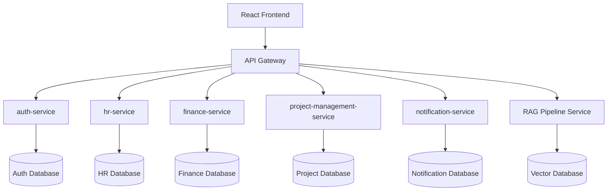
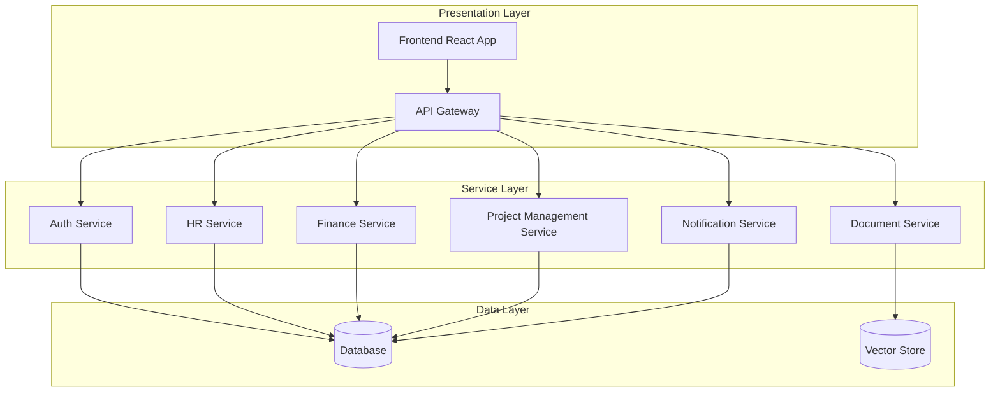
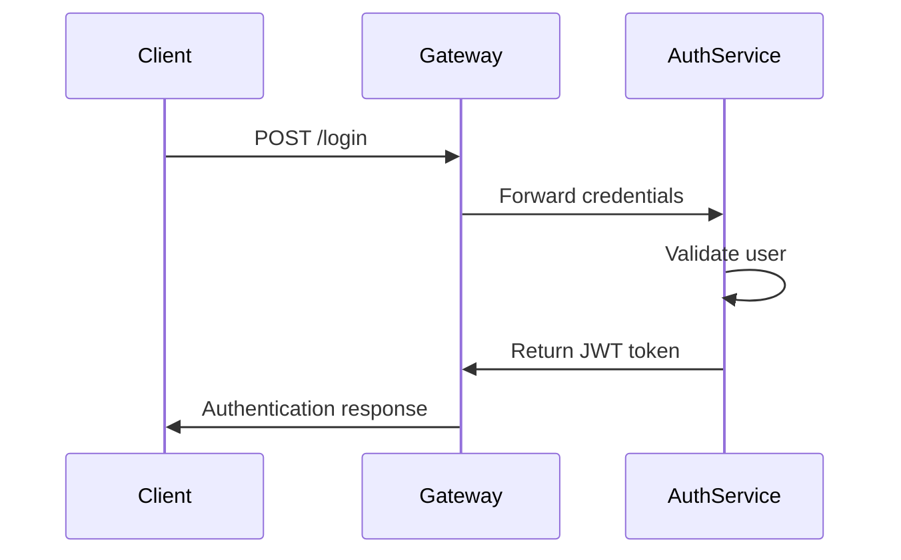
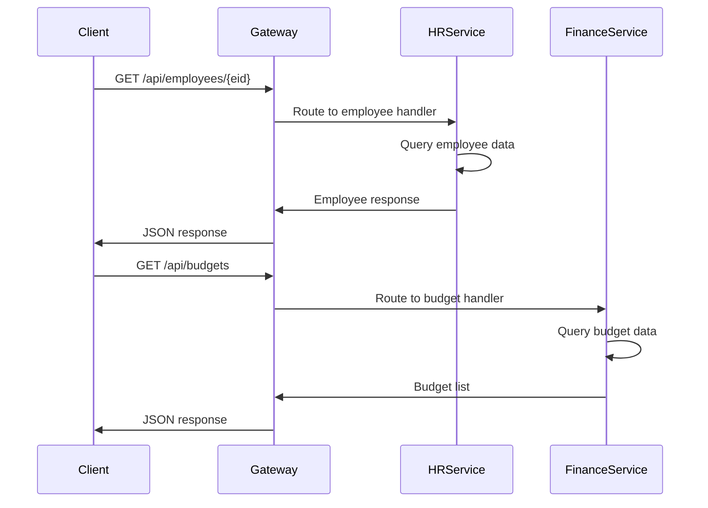
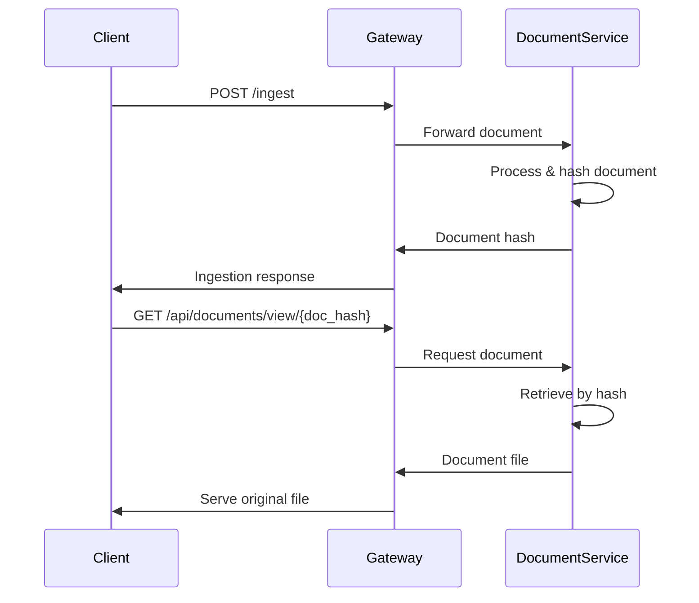
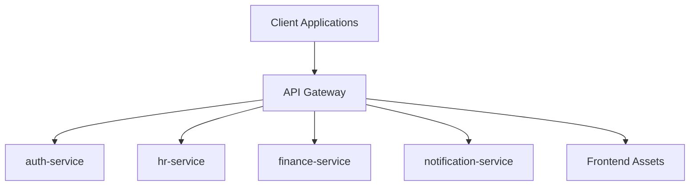
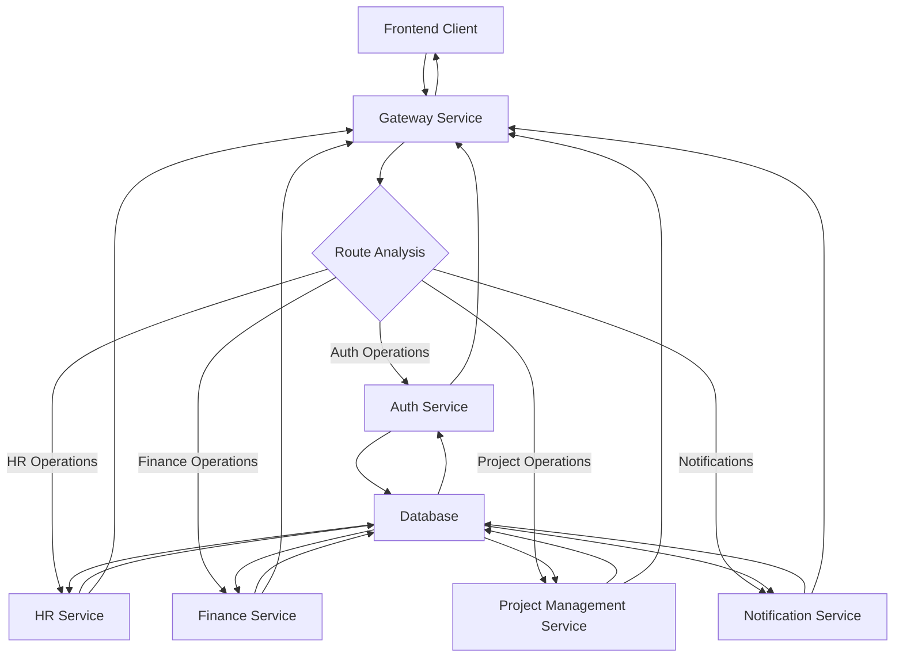
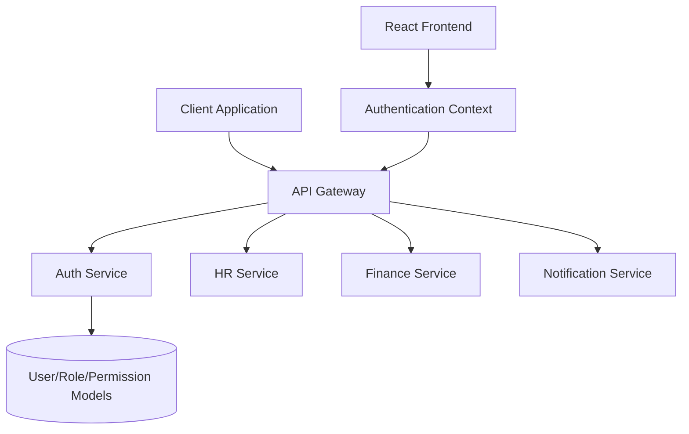
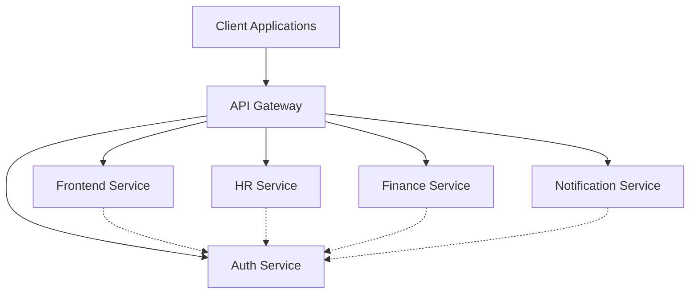

# architecture

## Repository Overview
OrganiStation is a multi-service organizational management platform designed using microservices architecture principles. The system provides comprehensive business management capabilities through a distributed service topology.

### System Purpose

- **Operational Management**: Employee lifecycle, attendance, and HR processes
- **Financial Control**: Budget planning, expense management, and invoice processing
- **Project Coordination**: Task management, milestone tracking, and project oversight
- **Document Handling**: Secure storage and retrieval with hash-based identification
- **Access Control**: Role-based authentication and granular permission management

### Architectural Approach

OrganiStation implements key architectural patterns:

- **Microservices Architecture**: Independent, loosely-coupled services
- **API Gateway Pattern**: Centralized routing and request management
- **RESTful API Design**: Standardized HTTP-based service communication

### Service Topology

The system comprises six primary services:

1. **Gateway Service**: API routing and static asset management
2. **Frontend Service**: React application with authentication integration
3. **Auth Service**: User authentication and authorization
4. **HR Service**: Human resources and attendance management
5. **Finance Service**: Financial operations and budget control
6. **Notification Service**: Communication and alert distribution

deployment

## Architecture Overview
OrganiStation follows a **microservices architecture** with a clear separation of concerns across multiple specialized services. The system is designed around domain-driven principles, with each service handling a specific business domain.

### System Architecture



### Core Services

#### API Gateway
- **Purpose**: Central entry point for all client requests
- **Responsibilities**: Request routing, authentication, static asset serving
- **Technology**: Serves compiled React frontend assets through public directory

#### Authentication Service (`auth-service`)
- **Purpose**: User authentication and authorization management
- **Key Components**:
  - JWT token management with `TokenPayload` structure
  - Role-based access control with `RoleResponse`, `UserResponse`, and `PermissionResponse` schemas
  - User registration, login, logout, and password management

#### Human Resources Service (`hr-service`)
- **Purpose**: Employee lifecycle and attendance management
- **Key Entities**: `Employee`, `Attendance`, `LeaveRequest`
- **Features**: Employee records, attendance tracking, leave request processing

#### Finance Service (`finance-service`)
- **Purpose**: Financial operations and budget management
- **Key Entities**: `Budget`, `Invoice`, `Expense`
- **Features**: Budget planning, invoice management, expense tracking

#### Project Management Service (`project-management-service`)
- **Purpose**: Project lifecycle and task management
- **Key Entities**: `Project`, `Task`, `Ticket`
- **Relationships**: Projects contain tasks and milestones, tickets are associated with projects

#### Notification Service (`notification-service`)
- **Purpose**: Multi-channel communication system
- **Features**: Email notifications, user-specific notifications, broadcast messaging
- **Configuration**: Centralized settings management through `Settings` class

#### RAG Pipeline Service
- **Purpose**: Document management and intelligent querying
- **Key Component**: `RAGPipeline` class for document ingestion and retrieval-augmented generation
- **Features**: Document hash-based identification, content querying, knowledge extraction

### Design Philosophy

#### Domain-Driven Design
- Each service represents a distinct business domain
- Clear entity boundaries with well-defined relationships
- Service-specific data models and business logic

#### RESTful API Design
- Consistent resource-based URL patterns (`/api/{resource}/{id}`)
- Standard HTTP methods for CRUD operations
- Hash-based document identification for content integrity

#### Microservices Patterns
- **Service Independence**: Each service maintains its own database and business logic
- **API-First**: All inter-service communication through well-defined APIs
- **Configuration Management**: Centralized settings with service-specific configurations
- **Authentication**: JWT-based stateless authentication across all services

### Data Architecture

#### Entity Relationships
- **Employee-Centric**: `LeaveRequest` and `Attendance` entities linked to employees via `employee_id`
- **Project-Centric**: `Ticket` entities associated with projects via `project_id`
- **Hierarchical**: Projects contain tasks and milestones in parent-child relationships

#### Identification Patterns
- **Hash-Based**: Documents identified by content hash for integrity
- **ID-Based**: Standard entities use typed IDs (eid, pid, tid, iid, etc.)
- **Composite Keys**: Some entities use combination of identifiers for uniqueness

## High-Level Design
### System Layers



### Core Subsystems

#### Authentication & Authorization Service
- **Boundary**: User identity, roles, and permissions management
- **Responsibilities**: JWT token handling, user registration/login, role-based access control
- **Key Components**: `TokenPayload`, `RoleResponse`, `UserResponse`, `PermissionResponse`

#### Human Resources Service
- **Boundary**: Employee lifecycle and attendance management
- **Responsibilities**: Employee records, attendance tracking, leave requests
- **Key Components**: `Employee`, `Attendance`, `LeaveRequest`

#### Finance Service
- **Boundary**: Financial operations and reporting
- **Responsibilities**: Budget management, expense tracking, invoice processing
- **Key Components**: `Budget`, `Expense`, `Invoice`

#### Project Management Service
- **Boundary**: Project and task coordination
- **Responsibilities**: Project lifecycle, task management, ticket tracking
- **Key Components**: `Project`, `Task`, `Ticket`

#### Document Service
- **Boundary**: Document storage and intelligent retrieval
- **Responsibilities**: Document ingestion, RAG pipeline, query processing
- **Key Components**: `RAGPipeline`, document hash-based identification

#### Notification Service
- **Boundary**: Communication and alerting
- **Responsibilities**: Email notifications, broadcast messaging, user-specific alerts
- **Key Components**: Email handlers, broadcast mechanisms

### Service Boundaries

database schemas
- **Authentication**: Centralized JWT-based authentication with service-level authorization
- **Communication**: Synchronous HTTP communication through the API gateway

### Cross-Cutting Concerns

- **Configuration Management**: Centralized settings through `Settings` classes
- **Error Handling**: Standardized HTTP status codes and error responses
- **Logging**: Distributed logging across all services
- **Health Monitoring**: Health check endpoints for service availability

## Component Design
### Core Business Components

The system is organized around key business entities that form the foundation of organizational management:

#### Data Models
- **Employee**: Core HR entity with properties for work-from-home tracking, status management, sick leave totals, hire dates, and email
- **Project**: Project management entity with owner assignment, priority levels, descriptions, status tracking, and date management
- **Task**: Task entity with status, priority, title, description, due dates, and assignee management
- **Ticket**: Support ticket entity with priority levels, reporter tracking, status management, and project association
- **Invoice**: Financial entity with client information, amounts, due dates, and status tracking
- **Expense**: Expense tracking with categorization, amounts, titles, status, and notes
- **Budget**: Financial planning entity with year, amount, department, month, period, and notes
- **LeaveRequest**: Employee leave management with date ranges, types, status, and reasons
- **Attendance**: Employee time tracking with check-in/out times, dates, and status

### Service Architecture Components

#### Microservices
- **auth-service**: Authentication and authorization with role-based access control
  - Contains schema models: RoleResponse, UserResponse, PermissionResponse
  - Handles user management, role assignments, and permission controls
- **hr-service**: Human resources management
  - Contains Attendance class for time tracking functionality
  - Manages employee data, leave requests, and attendance records
- **finance-service**: Financial operations management
  - Handles budgets, expenses, and invoices
  - Provides financial reporting and tracking capabilities
- **project-management-service**: Project and task coordination
  - Manages projects, tasks, tickets, and milestones
  - Coordinates project workflows and assignments
- **notification-service**: Communication and alerts
  - Contains Settings configuration for notification management
  - Handles email notifications, broadcasts, and user-specific alerts
- **gateway**: API gateway and frontend asset serving
  - Serves compiled frontend assets through public directory
  - Routes requests to appropriate backend services

### Component Interactions

#### Entity Relationships
- **Tickets** belong to **Projects** via project_id property
- **LeaveRequests** belong to **Employees** via employee_id property
- **Attendance** records belong to **Employees** via employee_id property
- **Projects** contain **Tasks** and **Milestones**
- **Employees** have associated **Attendance** records

#### Service Dependencies
- **Gateway** serves frontend assets and routes API requests
- **Auth-service** provides authentication for all other services
- **Notification-service** integrates with other services for alerts
- Services communicate through RESTful APIs with standardized endpoints

### Frontend Components

#### React Application Structure
- **App**: Main React application component
- **AuthProvider**: Authentication context provider for state management
- Component-based architecture with context providers for shared state

### Specialized Components

#### RAG Pipeline
- **RAGPipeline**: Retrieval-Augmented Generation service for document management and querying
- Handles document ingestion, storage, and intelligent querying capabilities

#### Configuration Management
- **Settings**: Application configuration with JWT settings and service URLs
- **TokenPayload**: JWT token structure with expiration, permissions, role, and subject data

### API Handler Components

The system implements a comprehensive set of handlers for CRUD operations:

#### Resource Management Handlers
- Document operations: ingest, query, view, delete
- Employee management: create, read, update, delete, attendance tracking
- Project coordination: create, update, delete, task management
- Financial operations: budget management, expense tracking, invoice handling
- Ticket system: create, update, delete, assignment management

#### Authentication Handlers
- User registration, login, logout
- Password management and token refresh
- Role and permission management

#### Notification Handlers
- Email sending, broadcasting, user-specific notifications
- Integration with other services for event-driven alerts

## Runtime Design
### Request Lifecycle

The OrganiStation system follows a standard microservices request flow pattern:

1. **Client Request**: Frontend applications send HTTP requests to the API gateway
2. **Gateway Routing**: The gateway service routes requests to appropriate backend services based on URL patterns
3. **Service Processing**: Individual services (auth, hr, finance, notification) handle business logic
4. **Response Assembly**: Services return responses through the gateway back to clients

### Execution Flows

#### Authentication Flow



#### Resource Management Flow



#### Document Processing Flow



### Concurrency Model

#### Service-Level Concurrency
- **Microservices Architecture**: Each service (auth, hr, finance, notification) runs independently
- **Stateless Design**: Services maintain no session state, enabling horizontal scaling
- **Request Isolation**: Individual requests are processed independently within each service

#### Gateway Concurrency
- **Asset Serving**: Gateway serves compiled frontend assets concurrently through public directory
- **Route Multiplexing**: Multiple client requests are routed simultaneously to backend services
- **Load Distribution**: Gateway distributes requests across service instances

#### Data Access Patterns
- **Resource-Based Routing**: Requests are routed based on resource type (employees, projects, documents)
- **ID-Based Isolation**: Operations on specific resources use unique identifiers (employee_id, project_id, doc_hash)
- **Hierarchical Access**: Related resources follow parent-child patterns (projects/{pid}/tasks, employees/{eid}/attendance)

#### Error Handling
- **Service Health Checks**: Each service exposes health endpoints (/api/auth/health, /api/health)
- **Graceful Degradation**: Services can operate independently if others are unavailable
- **Request Timeout Management**: Gateway handles timeouts for unresponsive services

## Integration Design
### API Gateway Pattern

OrganiStation implements a centralized API gateway that serves as the single entry point for all client requests. The gateway handles routing, asset serving, and request distribution to appropriate microservices.



### RESTful API Design

The system exposes a comprehensive REST API with standardized endpoints across all services:

#### Core Resource Endpoints
- **Employee Management**: `/api/employees/*` - CRUD operations for employee records
- **Project Management**: `/api/projects/*` - Project lifecycle management with nested resources
- **Document Management**: `/api/documents/*` - Document storage and retrieval with hash-based identification
- **Financial Operations**: `/api/budgets/*`, `/api/expenses/*`, `/api/invoices/*` - Financial resource management
- **Ticketing System**: `/api/tickets/*` - Issue tracking and resolution

#### Service-Specific Integrations

**Authentication Service**
- Health monitoring: `GET /api/auth/health`
- User management with role-based access control
- Session management with refresh token support

**HR Service**
- Attendance tracking: `POST /api/attendance`
- Employee-specific attendance retrieval: `GET /api/employees/{eid}/attendance`
- Leave request management

**Finance Service**
- Budget oversight: `GET /api/budgets`
- Expense and invoice lifecycle management
- Financial reporting capabilities

**Notification Service**
- Broadcast messaging: `POST /notifications/broadcast`
- User-specific notifications: `POST /notifications/user/{userId}`
- Email integration: `POST /notifications/send-email`

### Inter-Service Communication

- **Response Configuration**: Services implement standardized response models (RoleResponse, UserResponse, PermissionResponse)
- **Error Handling**: Consistent error response formats across all services
- **Health Monitoring**: Each service exposes health check endpoints for system monitoring

### Document Integration

The system implements a hash-based document management system:
- Documents are identified by unique hash values
- Original files served through dedicated view endpoints: `GET /api/documents/view/{doc_hash}`
- Document ingestion through: `POST /ingest`
- Query capabilities: `POST /api/query` and `POST /query`

### Frontend Integration

The gateway serves compiled frontend assets through a public directory structure, enabling seamless integration between the React frontend and backend services. Static assets are served with optimized file names (e.g., `index-DuQXh1_U.js`) for efficient caching and delivery.

## Data Flow Design
### Core Data Flow Patterns

OrganiStation implements several key data flow patterns that govern how information moves through the system:

#### 1. Request-Response Flow
The primary data flow follows a standard microservices request-response pattern:



#### 2. Entity-Specific Data Flows

**Employee Management Flow:**
1. Client requests employee data via `GET /api/employees`
2. Gateway routes to HR service
3. HR service queries Employee entities from database
4. Response includes employee details (status, hire_date, email, wfh_total, sick_total)
5. Related attendance data accessible via `GET /api/employees/{eid}/attendance`

**Project Management Flow:**
1. Project creation via `POST /api/projects`
2. Project entity stored with properties (owner, priority, description, status, due_date, start_date)
3. Tasks and milestones linked to projects via project_id
4. Task creation follows `POST /api/projects/{pid}/tasks` pattern
5. Tickets associated with projects through project_id relationship

**Financial Data Flow:**
1. Budget entities managed via `GET/POST /api/budgets`
2. Expense tracking through Expense entities (date, category, amount, title, status, notes)
3. Invoice management with Invoice entities (description, due_date, client_name, amount, status)
4. All financial data flows through the finance-service component

#### 3. Document Processing Flow

The system implements a specialized RAG (Retrieval-Augmented Generation) pipeline for document management:

1. **Document Ingestion:** `POST /ingest` → RAGPipeline service
2. **Document Storage:** Hash-based identification system for Document entities
3. **Document Retrieval:** `GET /api/documents` and `GET /api/documents/view/{doc_hash}`
4. **Document Querying:** `POST /api/query` for intelligent document search

#### 4. Authentication & Authorization Flow

1. User login via `POST /login` → Auth service
2. JWT token generation with TokenPayload (exp, permissions, role, sub)
3. Token validation on subsequent requests
4. Role-based access control through RoleResponse and PermissionResponse schemas
5. Password management via `POST /change-password`
6. Session management through `POST /refresh` and `POST /logout`

#### 5. Notification Flow

1. **Broadcast Notifications:** `POST /notifications/broadcast`
2. **User-Specific Notifications:** `POST /notifications/user/{userId}`
3. **Email Notifications:** `POST /notifications/send-email`
4. All notifications processed through the notification-service

#### 6. Leave Request Processing Flow

1. LeaveRequest entities created with employee_id association
2. Leave requests contain (end_date, employee_id, type, start_date, status, reason)
3. Updates processed via `PUT /api/leaves/{lid}`
4. Integration with Employee attendance tracking

#### 7. Data Consistency Patterns

- **Entity Relationships:** Maintained through foreign key patterns (employee_id, project_id)
- **Hash-Based Identification:** Documents use hash-based identification for integrity
- **Status Tracking:** Consistent status fields across entities (Employee, Project, Task, Ticket, Invoice, Expense)
- **Audit Trail:** Date tracking in entities (hire_date, due_date, start_date, end_date)

#### 8. Error Handling & Recovery

- Database reset capability via `POST /api/reset` and `POST /reset`
- Health check endpoints for service monitoring
- Structured error responses through service-specific schemas

This data flow design ensures consistent

## Security Architecture
### Authentication Flow

The OrganiStation platform implements a centralized security model with the auth-service as the primary authentication authority.



### Security Components

#### API Gateway Security Layer
- **Request Routing**: Centralized entry point for all client requests
- **Authentication Enforcement**: Validates authentication tokens before routing to services
- **Public Asset Management**: Secure handling of public resources

#### Authentication Service
- **User Management**: Comprehensive user model with authentication capabilities
- **Role-Based Access Control**: Role and permission models for fine-grained access control
- **Token Management**: Secure token generation and validation

#### Service Security Boundaries
- **HR Service**: Protected employee and attendance data access
- **Finance Service**: Secured budget management and financial data
- **Notification Service**: Controlled notification configuration and delivery

### Document Security
- **Hash-Based Identification**: Documents identified using secure hash mechanisms
- **Access Control Integration**: Document access tied to authentication service permissions

## Deployment Architecture
The OrganiStation system follows a microservices deployment topology with multiple independent services coordinated through an API gateway.

### Service Topology



### Deployment Components

| Component | Type | Purpose |
|-----------|------|----------|
| **Gateway** | API Gateway | Request routing, public asset serving, and service coordination |
| **Frontend** | React Application | User interface with authentication context management |
| **Auth Service** | Authentication Service | User, role, and permission management |
| **HR Service** | Business Service | Human resources and attendance functionality |
| **Finance Service** | Business Service | Budget management and financial operations |
| **Notification Service** | Support Service | System notifications and configuration management |

### Architectural Patterns

- **Microservices Architecture**: Independent, loosely-coupled services
- **API Gateway Pattern**: Centralized request routing and service orchestration
- **RESTful API Design**: Standardized HTTP-based service interfaces

### Service Communication

- Client requests are routed through the API gateway to appropriate service endpoints
- Authentication is centralized through the dedicated auth-service
- Services maintain independence while coordinating through well-defined APIs

## Dependency Analysis
### Internal Dependencies

#### Service-to-Service Dependencies

**Core Service Dependencies:**
- **Gateway Service** → Frontend Assets: Serves compiled React application assets through public directory
- **Auth Service** → Schema Models: Contains response configurations for roles, users, and permissions
- **Notification Service** → Configuration: Manages settings and service configurations

**Data Model Dependencies:**
- **Ticket** → **Project**: Tickets belong to projects via `project_id` property
- **LeaveRequest** → **Employee**: Leave requests belong to employees via `employee_id` property  
- **Attendance** → **Employee**: Attendance records belong to employees via `employee_id` property
- **Project** → **Task**: Projects contain tasks accessible via project endpoints
- **Project** → **Milestone**: Projects contain milestones accessible via project endpoints
- **Employee** → **Attendance**: Employees have attendance records accessible via employee ID

#### API Service Dependencies

**Identified Services:**
- `finance-service`: Handles budgets, expenses, and invoices
- `hr-service`: Manages employees, attendance, and leave requests
- `project-management-service`: Handles projects, tasks, and tickets
- `auth-service`: Manages authentication, users, roles, and permissions
- `notification-service`: Handles notifications and email services

**Cross-Service Resource Access:**
- Document management with hash-based identification
- User management across authentication and business services
- Project-based resource organization (tasks, milestones, tickets)

### External Dependencies

#### Technology Stack Dependencies

**Frontend Dependencies:**
- **React**: Main UI framework (evidenced by App.jsx and AuthContext.jsx)
- **JavaScript/ES6**: Frontend application logic
- **Build Tools**: Asset compilation and bundling (evidenced by compiled assets)

**Backend Dependencies:**
- **Python**: Primary backend language (evidenced by .py files and class structures)
- **FastAPI/Similar Framework**: REST API framework (evidenced by route patterns)
- **JWT**: Authentication token management (evidenced by TokenPayload class)

**Infrastructure Dependencies:**
- **Database**: Persistent storage for all business entities
- **File Storage**: Document storage system with hash-based identification
- **Email Service**: External email delivery for notifications

#### Rationale for Dependencies

**React Frontend:**
- **Modern UI Development**: Component-based architecture for maintainable interfaces
- **State Management**: Context-based authentication state management
- **Asset Optimization**: Compiled and minified assets for performance

**Hash-Based Document Management:**
- **Content Integrity**: Hash-based identification ensures document integrity
- **Deduplication**: Prevents storage of duplicate documents
- **Immutable References**: Stable document references across the system

**JWT Authentication:**
- **Stateless Authentication**: No server-side session storage required
- **Cross-Service Security**: Consistent authentication across microservices
- **Role-Based Access**: Embedded permissions and roles in token payload

## API Architecture
### Service API Structure

The OrganiStation platform exposes APIs through multiple specialized services, each handling specific business domains:

**Core Services**
- **Authentication Service**: User management, roles, and permissions
- **HR Service**: Employee management, attendance, and leave requests
- **Finance Service**: Budget management, expenses, and invoices
- **Project Management Service**: Projects, tasks, tickets, and milestones
- **Notification Service**: Email and broadcast notifications
- **Gateway Service**: API routing and frontend asset serving

### API Endpoint Categories

**Resource Management APIs**

```
# Employee Management
GET    /api/employees
GET    /api/employees/{eid}
PUT    /api/employees/{eid}
DELETE /api/employees/{eid}
GET    /api/employees/{eid}/attendance

# Project Management
GET    /api/projects
GET    /api/projects/{pid}
PUT    /api/projects/{pid}
DELETE /api/projects/{pid}
GET    /api/projects/{pid}/tasks
POST   /api/projects/{pid}/tasks
GET    /api/projects/{pid}/milestones

# Financial Management
GET    /api/budgets
POST   /api/budgets
GET    /api/expenses
POST   /api/expenses
PUT    /api/expenses/{eid}
DELETE /api/expenses/{eid}
GET    /api/invoices
PUT    /api/invoices/{iid}
DELETE /api/invoices/{iid}
```

**Authentication & Authorization APIs**

```
POST /login
POST /logout
POST /refresh
POST /register
POST /change-password
POST /roles
PUT  /roles/{role_name}
```

**Document & Knowledge Management APIs**

```
GET    /api/documents
GET    /api/documents/view/{doc_hash}
DELETE /api/documents/{doc_hash}
POST   /ingest
POST   /api/query
POST   /query
```

**Notification APIs**

```
POST /notifications/broadcast
POST /notifications/send-email
POST /notifications/user/{userId}
```

### Data Models

The API architecture supports the following core data models:

- **Employee**: `wfh_used`, `status`, `sick_total`, `hire_date`, `email`, `wfh_total`
- **Project**: `owner`, `priority`, `description`, `status`, `due_date`, `start_date`
- **Task**: `status`, `priority`, `title`, `description`, `due_date`, `assignee`
- **Ticket**: `priority`, `reporter`, `status`, `title`, `project_id`, `assignee`
- **Budget**: `year`, `amount`, `department`, `month`, `period`, `notes`
- **Invoice**: `description`, `due_date`, `client_name`, `amount`, `status`
- **Expense**: `date`, `category`, `amount`, `title`, `status`, `notes`
- **LeaveRequest**: `end_date`, `employee_id`, `type`, `start_date`, `status`, `reason`
- **Attendance**: `employee_id`, `check_out`, `check_in`, `date`, `status`

### Integration Patterns

**RAG Pipeline Integration**
- Document ingestion and querying through specialized RAG service
- Hash-based document identification for efficient retrieval
- Query processing with retrieval-augmented generation capabilities

**Cross-Service Communication**
- Standardized notification patterns for service coordination
- Consistent authentication token validation across services
- Unified configuration management through `Settings` classes