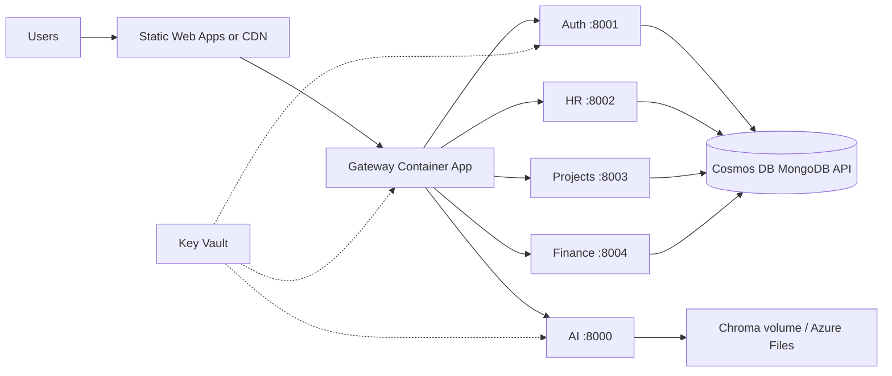

# Deploying OrganiStation on Microsoft Azure (Microservices)

> **Production architecture, Foundry, Cosmos DB, security, and CI/CD:** see [`AZURE_PRODUCTION_GUIDE.md`](./AZURE_PRODUCTION_GUIDE.md).

This guide walks through deploying **OrganiStation** as a microservices application on Azure. The stack includes five Python (FastAPI) services, a Node.js API gateway, a React frontend, and MongoDB.

| Component | Technology | Default port (local) |
|-----------|------------|----------------------|
| Gateway | Node.js / Express | 3000 |
| AI service | Python / FastAPI | 8000 |
| Auth service | Python / FastAPI | 8001 |
| HR service | Python / FastAPI | 8002 |
| Project management | Python / FastAPI | 8003 |
| Finance service | Python / FastAPI | 8004 |
| Frontend | React / Vite | 5173 (dev) |

**Recommended Azure services**

| Purpose | Azure service |
|---------|----------------|
| Run containers | [Azure Container Apps](https://learn.microsoft.com/azure/container-apps/) |
| Store images | [Azure Container Registry (ACR)](https://learn.microsoft.com/azure/container-registry/) |
| MongoDB | [Azure Cosmos DB for MongoDB](https://learn.microsoft.com/azure/cosmos-db/mongodb/) or [Azure DocumentDB (MongoDB compatibility)](https://learn.microsoft.com/azure/documentdb/) |
| Secrets | [Azure Key Vault](https://learn.microsoft.com/azure/key-vault/) |
| Static UI | [Azure Static Web Apps](https://learn.microsoft.com/azure/static-web-apps/) or Container Apps + gateway |
| Observability | [Application Insights](https://learn.microsoft.com/azure/azure-monitor/app/app-insights-overview) |
| Optional API layer | [Azure API Management](https://learn.microsoft.com/azure/api-management/) |

---

## Architecture (target)



Traffic enters through the **gateway** (public). Backend microservices can use **internal ingress** so they are not exposed to the internet. The gateway proxies `/api/*` to each service (see `gateway/src/app.js`).

---

## Prerequisites

1. **Azure subscription** with permission to create resources (Owner or Contributor on a resource group).
2. **Azure CLI** installed and logged in:
   ```bash
   az login
   az account set --subscription "<YOUR_SUBSCRIPTION_NAME_OR_ID>"
   ```
3. **Docker Desktop** (or Docker Engine) for building images locally.
4. **Node.js 20+** and **Python 3.11+** (for local validation before deploy).
5. **Git** repository pushed to GitHub or Azure DevOps (optional, for CI/CD).

Set variables used throughout this guide (adjust names and region):

```bash
# Bash / Git Bash / WSL
export RESOURCE_GROUP="rg-organistation-prod"
export LOCATION="australiaeast"          # pick a region close to users
export ACR_NAME="organistationregistry"          # globally unique, alphanumeric only
export ENV_NAME="cae-organistation-prod"        # Container Apps environment
export KV_NAME="kv-organistation-prod"          # Key Vault name (globally unique)
```

```powershell
# PowerShell
$RESOURCE_GROUP = "rg-organistation-prod"
$LOCATION = "australiaeast"
$ACR_NAME = "organistationregistry"
$ENV_NAME = "cae-organistation-prod"
$KV_NAME = "kv-organistation-prod"
```

---

## Step 1 — Create a resource group

```bash
az group create --name $RESOURCE_GROUP --location $LOCATION
```

All resources for this deployment should live in this group (or split dev/prod into separate groups).

---

## Step 2 — Provision MongoDB (Cosmos DB)

Auth, HR, project management, and finance services use MongoDB (`MONGODB_URI`, `DB_NAME` in each service `.env`).

### Option A: Cosmos DB for MongoDB (recommended)

```bash
az cosmosdb create \
  --name "cosmos-organistation-prod" \
  --resource-group $RESOURCE_GROUP \
  --kind MongoDB \
  --server-version "4.2" \
  --default-consistency-level Session \
  --locations regionName=$LOCATION failoverPriority=0 isZoneRedundant=False

az cosmosdb mongodb database create \
  --account-name "cosmos-organistation-prod" \
  --resource-group $RESOURCE_GROUP \
  --name organistation_auth

az cosmosdb mongodb database create \
  --account-name "cosmos-organistation-prod" \
  --resource-group $RESOURCE_GROUP \
  --name organistation_hr

az cosmosdb mongodb database create \
  --account-name "cosmos-organistation-prod" \
  --resource-group $RESOURCE_GROUP \
  --name organistation_projects

az cosmosdb mongodb database create \
  --account-name "cosmos-organistation-prod" \
  --resource-group $RESOURCE_GROUP \
  --name organistation_finance
```

Get the connection string:

```bash
az cosmosdb keys list \
  --name "cosmos-organistation-prod" \
  --resource-group $RESOURCE_GROUP \
  --type connection-strings \
  --query "connectionStrings[0].connectionString" -o tsv
```

Use this value as `MONGODB_URI` in Azure (append the database name or set `DB_NAME` per service as you do locally).

**Firewall:** In the Azure portal, under Cosmos DB → **Networking**, allow access from your Container Apps environment (or use VNet integration). For initial testing only, you can allow Azure services; tighten this for production.

---

## Step 3 — Create Azure Container Registry (ACR)

```bash
az acr create \
  --resource-group $RESOURCE_GROUP \
  --name $ACR_NAME \
  --sku Basic \
  --admin-enabled true

az acr login --name $ACR_NAME
```

Note the login server: `$ACR_NAME.azurecr.io`.

---

## Step 4 — Dockerfiles (multistage)

Each microservice uses a **two-stage** Python build (`builder` → `runtime`) or a **three-stage** gateway build (`frontend-builder` → `deps` → `runtime`). Images run as a non-root `app` user and include health checks.

| Service | Dockerfile | Build context | Port |
|---------|------------|---------------|------|
| Auth | `auth-service/Dockerfile` | `./auth-service` | 8001 |
| AI | `ai-service/Dockerfile` | `./ai-service` | 8000 |
| HR | `hr-service/Dockerfile` | `./hr-service` | 8002 |
| Projects | `project-management-service/Dockerfile` | `./project-management-service` | 8003 |
| Finance | `finance-service/Dockerfile` | `./finance-service` | 8004 |
| Gateway | `gateway/Dockerfile` | `./gateway` | 3000 |

### Python services (pattern)

Stage 1 installs dependencies; stage 2 copies `/usr/local` and application code into `python:3.11-slim`.

### Gateway

Stage 1 installs production npm dependencies; stage 2 runs as the built-in `node` user. Build the frontend separately and copy `frontend/dist/*` into `gateway/public/` before building the gateway image, or deploy the frontend separately (see Step 10).

```bash
docker build -t organistation-gateway:latest ./gateway
```

---

## Step 5 — Build and push images to ACR

From the repository root:

```bash
# Auth
docker build -t $ACR_NAME.azurecr.io/organistation-auth:latest ./auth-service
docker push $ACR_NAME.azurecr.io/organistation-auth:latest

# AI
docker build -t $ACR_NAME.azurecr.io/organistation-ai:latest ./ai-service
docker push $ACR_NAME.azurecr.io/organistation-ai:latest

# HR
docker build -t $ACR_NAME.azurecr.io/organistation-hr:latest ./hr-service
docker push $ACR_NAME.azurecr.io/organistation-hr:latest

# Projects
docker build -t $ACR_NAME.azurecr.io/organistation-projects:latest ./project-management-service
docker push $ACR_NAME.azurecr.io/organistation-projects:latest

# Finance
docker build -t $ACR_NAME.azurecr.io/organistation-finance:latest ./finance-service
docker push $ACR_NAME.azurecr.io/organistation-finance:latest

# Gateway (after frontend build is copied to gateway/public, if using single entry point)
docker build -t $ACR_NAME.azurecr.io/organistation-gateway:latest ./gateway
docker push $ACR_NAME.azurecr.io/organistation-gateway:latest
```

Enable ACR tasks for cloud builds (optional):

```bash
az acr build --registry $ACR_NAME --image organistation-auth:latest ./auth-service
```

---

## Step 6 — Create Key Vault and store secrets

```bash
az keyvault create \
  --name $KV_NAME \
  --resource-group $RESOURCE_GROUP \
  --location $LOCATION

# Examples — use your real values
az keyvault secret set --vault-name $KV_NAME --name "JWT-SECRET" --value "<strong-random-secret>"
az keyvault secret set --vault-name $KV_NAME --name "MONGODB-URI" --value "<cosmos-connection-string>"
az keyvault secret set --vault-name $KV_NAME --name "GEMINI-API-KEY" --value "<your-ai-api-key>"
```

Never commit `.env` files; use `.env.example` as templates only.

---

## Step 7 — Create Container Apps environment

```bash
az extension add --name containerapp --upgrade

az provider register --namespace Microsoft.App
az provider register --namespace Microsoft.OperationalInsights

az containerapp env create \
  --name $ENV_NAME \
  --resource-group $RESOURCE_GROUP \
  --location $LOCATION
```

Optional: integrate with a **Log Analytics workspace** (recommended for Application Insights):

```bash
az monitor log-analytics workspace create \
  --resource-group $RESOURCE_GROUP \
  --workspace-name "law-organistation-prod"

# Pass --logs-workspace-id and --logs-workspace-key when creating the environment
```

---

## Step 8 — Deploy backend microservices

Get ACR credentials:

```bash
ACR_USERNAME=$(az acr credential show --name $ACR_NAME --query username -o tsv)
ACR_PASSWORD=$(az acr credential show --name $ACR_NAME --query "passwords[0].value" -o tsv)
```

### 8.1 Auth service (internal ingress)

```bash
az containerapp create \
  --name "ca-organistation-auth" \
  --resource-group $RESOURCE_GROUP \
  --environment $ENV_NAME \
  --image "$ACR_NAME.azurecr.io/organistation-auth:latest" \
  --registry-server "$ACR_NAME.azurecr.io" \
  --registry-username $ACR_USERNAME \
  --registry-password $ACR_PASSWORD \
  --target-port 8001 \
  --ingress internal \
  --min-replicas 1 \
  --max-replicas 3 \
  --cpu 0.5 --memory 1Gi \
  --env-vars \
    PORT=8001 \
    HOST=0.0.0.0 \
    MONGODB_URI=secretref:mongodb-uri \
    DB_NAME=organistation_auth \
    JWT_SECRET=secretref:jwt-secret \
    JWT_ACCESS_EXPIRY_MINUTES=15 \
    JWT_REFRESH_EXPIRY_DAYS=7
```

For production, bind secrets from Key Vault using [Container Apps secrets](https://learn.microsoft.com/azure/container-apps/manage-secrets) instead of plain `--env-vars` for sensitive values.

Record the internal FQDN:

```bash
AUTH_FQDN=$(az containerapp show --name ca-organistation-auth --resource-group $RESOURCE_GROUP --query properties.configuration.ingress.fqdn -o tsv)
echo "https://$AUTH_FQDN"
```

### 8.2 HR, project management, finance

Repeat `az containerapp create` for each service with:

| App name | Image | Port | DB_NAME |
|----------|-------|------|---------|
| `ca-organistation-hr` | `organistation-hr:latest` | 8002 | `organistation_hr` |
| `ca-organistation-projects` | `organistation-projects:latest` | 8003 | `organistation_projects` |
| `ca-organistation-finance` | `organistation-finance:latest` | 8004 | `organistation_finance` |

Use `--ingress internal` for all backends.

### 8.3 AI service

```bash
az containerapp create \
  --name "ca-organistation-ai" \
  --resource-group $RESOURCE_GROUP \
  --environment $ENV_NAME \
  --image "$ACR_NAME.azurecr.io/organistation-ai:latest" \
  --registry-server "$ACR_NAME.azurecr.io" \
  --registry-username $ACR_USERNAME \
  --registry-password $ACR_PASSWORD \
  --target-port 8000 \
  --ingress internal \
  --min-replicas 1 \
  --max-replicas 2 \
  --cpu 1.0 --memory 2Gi \
  --env-vars \
    PORT=8000 \
    HOST=0.0.0.0 \
    CHROMA_DB_PATH=/app/chroma_db \
    GEMINI_API_KEY=secretref:gemini-api-key
```

Attach Azure Files for `chroma_db` if embeddings must persist across restarts ([storage mounts](https://learn.microsoft.com/azure/container-apps/storage-mounts)).

---

## Step 9 — Deploy the gateway (public ingress)

The gateway must reach internal services. Use each Container App’s **internal URL** (from the environment DNS suffix).

```bash
AI_FQDN=$(az containerapp show --name ca-organistation-ai --resource-group $RESOURCE_GROUP --query properties.configuration.ingress.fqdn -o tsv)
HR_FQDN=$(az containerapp show --name ca-organistation-hr --resource-group $RESOURCE_GROUP --query properties.configuration.ingress.fqdn -o tsv)
# ... same for projects and finance

az containerapp create \
  --name "ca-organistation-gateway" \
  --resource-group $RESOURCE_GROUP \
  --environment $ENV_NAME \
  --image "$ACR_NAME.azurecr.io/organistation-gateway:latest" \
  --registry-server "$ACR_NAME.azurecr.io" \
  --registry-username $ACR_USERNAME \
  --registry-password $ACR_PASSWORD \
  --target-port 3000 \
  --ingress external \
  --min-replicas 1 \
  --max-replicas 5 \
  --env-vars \
    PORT=3000 \
    JWT_SECRET=secretref:jwt-secret \
    AUTH_SERVICE_URL="https://$AUTH_FQDN" \
    AI_SERVICE_URL="https://$AI_FQDN" \
    HR_SERVICE_URL="https://$HR_FQDN" \
    PROJECT_SERVICE_URL="https://<projects-fqdn>" \
    FINANCE_SERVICE_URL="https://<finance-fqdn>"
```

**Important:** `JWT_SECRET` on the gateway must match the auth service.

Get the public gateway URL:

```bash
GATEWAY_URL=$(az containerapp show --name ca-organistation-gateway --resource-group $RESOURCE_GROUP --query properties.configuration.ingress.fqdn -o tsv)
echo "https://$GATEWAY_URL"
```

Test health:

```bash
curl "https://$GATEWAY_URL/api/health"
```

---

## Step 10 — Deploy the frontend

### Option A: Azure Static Web Apps (recommended for React/Vite)

1. Build locally with the gateway API URL:
   ```bash
   cd frontend
   # If the app calls /api relative to the same host, point SWA proxy to gateway
   npm ci
   npm run build
   ```
2. In Azure Portal → **Create resource** → **Static Web App**.
3. Connect your GitHub repo, set app location `frontend`, output `dist`.
4. Configure **routes** so `/api/*` proxies to `https://<gateway-fqdn>` (see [SWA configuration](https://learn.microsoft.com/azure/static-web-apps/configuration)).

`frontend/vite.config.js` already proxies `/api` to `http://localhost:3000` in development. For production, either:

- Serve the SPA from the gateway (`gateway/public` after `npm run build` + copy `dist/*`), or  
- Use Static Web Apps with an API proxy rule to the gateway URL.

### Option B: Serve SPA from the gateway container

```bash
cd frontend && npm ci && npm run build
cp -r dist/* ../gateway/public/
docker build -t $ACR_NAME.azurecr.io/organistation-gateway:latest ./gateway
docker push $ACR_NAME.azurecr.io/organistation-gateway:latest
az containerapp update --name ca-organistation-gateway --resource-group $RESOURCE_GROUP --image "$ACR_NAME.azurecr.io/organistation-gateway:latest"
```

Users then use only the gateway URL for UI and API.

---

## Step 11 — Networking and security (production)

1. **Internal-only backends** — Keep auth, AI, HR, projects, and finance on `internal` ingress; only the gateway is `external`.
2. **HTTPS** — Container Apps provides TLS on `*.azurecontainerapps.io` FQDNs.
3. **Custom domain** — Map a domain to the gateway (and SWA) via Container Apps custom domains + DNS CNAME.
4. **CORS** — Restrict `allow_origins` in FastAPI services to your frontend origin instead of `*`.
5. **Managed identity** — Use [ACR pull with managed identity](https://learn.microsoft.com/azure/container-apps/managed-identity-image-pull) instead of admin user/password.
6. **Key Vault references** — Wire Container Apps to Key Vault for `JWT_SECRET`, `MONGODB_URI`, `GEMINI_API_KEY`.
7. **Cosmos DB firewall** — Allow only your Container Apps outbound IPs or VNet integration.
8. **Rotate secrets** — Replace default JWT secret from `gateway/.env` before production.

---

## Step 12 — Observability

1. Enable **Application Insights** on the Container Apps environment.
2. View logs:
   ```bash
   az containerapp logs show --name ca-organistation-gateway --resource-group $RESOURCE_GROUP --follow
   ```
3. Set alerts on HTTP 5xx rates, CPU/memory, and Cosmos DB RU consumption.

---

## Step 13 — CI/CD (optional)

Use **GitHub Actions** or **Azure DevOps**:

1. On push to `main`, run tests.
2. `az acr build` for each changed service.
3. `az containerapp update --image ...` to roll out new revisions.
4. Store `AZURE_CREDENTIALS` (service principal) or use OIDC federated credentials in GitHub.

Minimal GitHub Actions secret set:

- `AZURE_CLIENT_ID`, `AZURE_TENANT_ID`, `AZURE_SUBSCRIPTION_ID`
- Or a single `AZURE_CREDENTIALS` JSON from `az ad sp create-for-rbac`

---

## Step 14 — Alternative: Azure Kubernetes Service (AKS)

Use AKS if you need full Kubernetes control, service mesh, or complex networking.

1. `az aks create` with ACR attached (`--attach-acr $ACR_NAME`).
2. One **Deployment + Service** per microservice.
3. **Ingress controller** (NGINX or Application Gateway Ingress Controller) routes `/api` to the gateway Service.
4. **Helm** or **Kustomize** to manage manifests.
5. MongoDB: still use Cosmos DB; do not run MongoDB in-cluster for production unless you operate it yourself.

Container Apps is simpler for this repo’s size; AKS is justified at larger scale or strict K8s requirements.

---

## Step 15 — Post-deployment verification

| Check | Command / action |
|-------|------------------|
| Gateway health | `GET https://<gateway-fqdn>/api/health` |
| Auth health | `GET https://<auth-fqdn>/health` (internal/VNet only) |
| Login | `POST https://<gateway-fqdn>/api/auth/login` with valid credentials |
| Frontend | Open Static Web App URL or gateway root |
| Logs | `az containerapp logs show` per app |

Default admin user (if seeded by auth service): confirm in `auth-service/src/utils/seeder.py` and **change passwords immediately** in production.

---

## Environment variable reference

### Gateway (`gateway/.env`)

| Variable | Description |
|----------|-------------|
| `PORT` | Listen port (3000) |
| `JWT_SECRET` | Must match auth service |
| `AUTH_SERVICE_URL` | Base URL of auth Container App |
| `AI_SERVICE_URL` | Base URL of AI Container App |
| `HR_SERVICE_URL` | Base URL of HR Container App |
| `PROJECT_SERVICE_URL` | Base URL of project service |
| `FINANCE_SERVICE_URL` | Base URL of finance service |

### Auth (`auth-service/.env`)

| Variable | Description |
|----------|-------------|
| `PORT`, `HOST` | Server bind |
| `MONGODB_URI` | Cosmos DB connection string |
| `DB_NAME` | `organistation_auth` |
| `JWT_SECRET` | Signing key |
| `JWT_ACCESS_EXPIRY_MINUTES` | Access token TTL |
| `JWT_REFRESH_EXPIRY_DAYS` | Refresh token TTL |

### AI (`ai-service/.env`)

| Variable | Description |
|----------|-------------|
| `PORT`, `HOST` | Server bind |
| `CHROMA_DB_PATH` | Vector DB path (use volume in Azure) |
| `GEMINI_API_KEY` | Google Gemini API key |

### HR / Projects / Finance

| Variable | Description |
|----------|-------------|
| `PORT`, `HOST` | Server bind |
| `MONGODB_URI` | Cosmos connection string |
| `DB_NAME` | `organistation_hr`, `organistation_projects`, or `organistation_finance` |

---

## Local development (reference)

```powershell
# Terminal 1–5: Python services (from each service folder)
.\.venv\Scripts\python -m uvicorn src.app:app --host 0.0.0.0 --port 8001 --reload   # auth (from auth-service/)
.\.venv\Scripts\python -m uvicorn src.app:app --host 0.0.0.0 --port 8000 --reload   # ai (from ai-service/)
.\.venv\Scripts\python app.py                                                        # hr, projects, finance

# Terminal 6: Gateway
cd gateway && npm start

# Terminal 7: Frontend
cd frontend && npm run dev
```

Open http://localhost:5173 — API calls proxy to http://localhost:3000.

---

## Cost and scaling tips

- Start with **min-replicas 0 or 1** on non-critical services; scale on HTTP load in Container Apps.
- Use **Cosmos DB serverless** or autoscale RU for variable workloads.
- Keep AI service on higher memory (Chroma + embeddings).
- Use **Azure Budgets** and cost alerts on the resource group.

---

## Troubleshooting

| Symptom | Likely cause |
|---------|----------------|
| `502` from gateway | Backend Container App down or wrong `*_SERVICE_URL` |
| `401` on API routes | Missing `Authorization: Bearer <token>` |
| Auth fails at startup | Invalid `MONGODB_URI` or Cosmos firewall |
| AI errors | Missing `GEMINI_API_KEY` or Chroma path not writable |
| CORS errors in browser | Frontend origin not allowed; SWA proxy misconfigured |

---

## Checklist before go-live

- [ ] All `.env` secrets in Key Vault, not in Git
- [ ] Root `.gitignore` excludes `.env`, `node_modules`, `.venv`, `chroma_db`
- [ ] Multistage Dockerfiles present; images pushed to ACR
- [ ] `JWT_SECRET` rotated and consistent (gateway + auth)
- [ ] Backends use internal ingress; only gateway is public
- [ ] Cosmos DB networking locked down
- [ ] Default admin credentials changed
- [ ] Application Insights and alerts configured
- [ ] Custom domain and TLS (if applicable)

For questions specific to this repository’s routing rules, see `gateway/src/app.js` and each service’s `app.py`.
