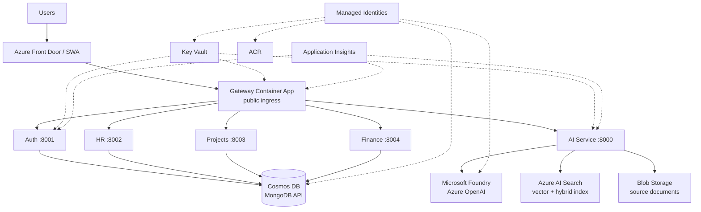
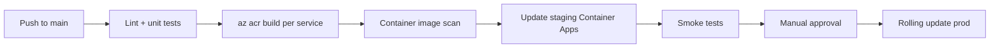

# OrganiStation — Azure Production Guide

This document describes how to run **OrganiStation** as a production-grade application on Microsoft Azure. It complements the step-by-step CLI walkthrough in [`AZURE_DEPLOYMENT.md`](./AZURE_DEPLOYMENT.md).

**Audience:** engineers preparing dev → staging → production deployments.

**Target stack:**

| Capability | Azure service |
|------------|---------------|
| Compute (microservices) | [Azure Container Apps](https://learn.microsoft.com/azure/container-apps/) |
| Container images | [Azure Container Registry](https://learn.microsoft.com/azure/container-registry/) |
| Database (MongoDB API) | [Azure Cosmos DB for MongoDB](https://learn.microsoft.com/azure/cosmos-db/mongodb/) |
| AI / RAG (future) | [Microsoft Foundry](https://learn.microsoft.com/azure/foundry/) + [Azure AI Search](https://learn.microsoft.com/azure/search/) |
| Document storage (RAG source) | [Azure Blob Storage](https://learn.microsoft.com/azure/storage/blobs/) |
| Secrets | [Azure Key Vault](https://learn.microsoft.com/azure/key-vault/) |
| Identity | [Microsoft Entra ID](https://learn.microsoft.com/entra/identity/) |
| Frontend | [Azure Static Web Apps](https://learn.microsoft.com/azure/static-web-apps/) or gateway-served SPA |
| Observability | [Application Insights](https://learn.microsoft.com/azure/azure-monitor/app/app-insights-overview) + Log Analytics |
| Optional edge / API | [Azure Front Door](https://learn.microsoft.com/azure/frontdoor/) / [API Management](https://learn.microsoft.com/azure/api-management/) |

---

## 1. Production architecture



**Design principles**

1. **Single public entry point** — only the gateway (or Static Web Apps + API proxy) is internet-facing.
2. **Internal backends** — auth, AI, HR, projects, and finance use Container Apps **internal ingress**.
3. **No secrets in Git or images** — Key Vault + managed identity + Container Apps secret references.
4. **Managed AI** — replace local ChromaDB + third-party API keys with Foundry + AI Search for production RAG.
5. **Separate environments** — dev, staging, and prod in separate resource groups (or subscriptions).

---

## 2. Environment strategy

Use **one resource group per environment** (recommended naming):

| Environment | Resource group | Purpose |
|-------------|----------------|---------|
| `dev` | `rg-organistation-dev` | Developer testing, relaxed firewall |
| `staging` | `rg-organistation-staging` | Pre-prod validation, prod-like config |
| `prod` | `rg-organistation-prod` | Customer-facing |

**Rules**

- Never share Key Vault, Cosmos DB, or Foundry projects across environments.
- Use the same Dockerfile / image tag strategy; promote immutable tags (`:20250606.1`) not `:latest` in prod.
- Staging must use the same ingress pattern (internal backends + public gateway) as production.

**Suggested region**

Pick one primary region close to users (e.g. `australiaeast`, `eastus`). Keep Cosmos DB, Container Apps environment, Foundry hub, and AI Search in the **same region** to minimize latency and egress cost.

---

## 3. Cosmos DB (production database)

OrganiStation uses four logical databases on the MongoDB API:

| Service | `DB_NAME` |
|---------|-----------|
| Auth | `organistation_auth` |
| HR | `organistation_hr` |
| Projects | `organistation_projects` |
| Finance | `organistation_finance` |

### 3.1 Provisioning

```bash
az cosmosdb create \
  --name "cosmos-organistation-prod" \
  --resource-group rg-organistation-prod \
  --kind MongoDB \
  --server-version "4.2" \
  --default-consistency-level Session \
  --capabilities EnableMongo \
  --locations regionName=australiaeast failoverPriority=0 isZoneRedundant=True
```

Create each database (see [`AZURE_DEPLOYMENT.md`](./AZURE_DEPLOYMENT.md) Step 2 for full commands).

### 3.2 Production settings

| Setting | Recommendation |
|---------|----------------|
| **Tier** | Provisioned throughput with autoscale for predictable prod workloads; serverless for dev/low traffic |
| **Consistency** | `Session` (default) — good balance for this app |
| **Multi-region** | Enable secondary region for prod DR if RTO/RPO requires it |
| **Networking** | Disable public access; use private endpoint + VNet integration on Container Apps |
| **Auth** | Prefer Entra ID / connection string in Key Vault; rotate keys on schedule |
| **Backup** | Continuous backup (periodic backup for MongoDB API) — confirm tier supports your RPO |

### 3.3 Connection from Container Apps

Store the connection string in Key Vault as `MONGODB-URI`:

```bash
az keyvault secret set --vault-name kv-organistation-prod \
  --name "MONGODB-URI" \
  --value "<cosmos-connection-string>"
```

Each Python service receives:

```env
MONGODB_URI=secretref:mongodb-uri
DB_NAME=organistation_auth   # per service
```

**Note:** Inside Docker/Container Apps, `mongodb://localhost:27017` does not work. Always use the Cosmos connection string.

### 3.4 Indexes and data lifecycle

- Auth service creates indexes on startup (users, roles). Verify index policies in Cosmos **Index Policy** for write-heavy collections.
- Plan retention for HR/finance audit data per compliance requirements.
- Use separate Cosmos accounts for prod vs non-prod — never point staging at production data.

---

## 4. Microsoft Foundry (AI service — production path)

Today, `ai-service` uses **ChromaDB** locally and optional **Gemini/Groq** API keys (`ai-service/src/rag_pipeline.py`). That is suitable for local development only.

For production, migrate to **Microsoft Foundry** with **Azure AI Search** as the retrieval layer.

### 4.1 Why migrate

| Local (current) | Azure (production) |
|-----------------|-------------------|
| ChromaDB on container disk | Azure AI Search (managed, scalable index) |
| Gemini/Groq API keys | Azure OpenAI via Foundry (Entra ID, private networking) |
| No document ACLs | Document-level security filters in AI Search |
| Manual backup of vectors | Managed index + Blob source of truth |
| Single-container memory limits | Independent scaling of AI compute and search |

### 4.2 Foundry resources to create

1. **AI Hub** — shared governance, policies, connections (one per environment).
2. **AI Project** — workspace for models, indexes, and deployments.
3. **Azure OpenAI deployment** — e.g. `gpt-4o-mini` (chat) + `text-embedding-3-small` (embeddings).
4. **Azure AI Search** — Standard tier or higher for vector + hybrid search.
5. **Storage account + Blob container** — raw PDFs/TXT/MD before indexing.
6. **Optional:** Document Intelligence for high-quality PDF extraction.

Portal: [Microsoft Foundry](https://ai.azure.com) → create Hub → create Project → deploy models.

Docs: [RAG in Microsoft Foundry](https://learn.microsoft.com/azure/foundry/concepts/retrieval-augmented-generation)

### 4.3 Recommended RAG pattern (classic production)

```text
Upload document
    → Blob Storage (source of truth)
    → Indexer / ingestion pipeline
    → Azure AI Search index (text + vector fields)
    → ai-service query endpoint
    → Hybrid search (keyword + vector)
    → Top-k chunks as context
    → Azure OpenAI chat completion (Foundry deployment)
    → Response + citations
```

For complex multi-step Q&A, evaluate **agentic retrieval** on AI Search (preview) — see [Agentic retrieval overview](https://learn.microsoft.com/en-us/azure/search/agentic-retrieval-overview).

### 4.4 ai-service changes (future code work)

Plan to refactor `ai-service` to call Azure instead of Chroma/Gemini:

| Current env var | Production replacement |
|-----------------|------------------------|
| `GEMINI_API_KEY` | Remove — use managed identity |
| `GROQ_API_KEY` | Remove |
| `CHROMA_DB_PATH` | Remove — use AI Search index name |
| — | `AZURE_OPENAI_ENDPOINT` |
| — | `AZURE_OPENAI_CHAT_DEPLOYMENT` |
| — | `AZURE_OPENAI_EMBEDDING_DEPLOYMENT` |
| — | `AZURE_SEARCH_ENDPOINT` |
| — | `AZURE_SEARCH_INDEX` |
| — | `AZURE_STORAGE_ACCOUNT` + container for uploads |

**Authentication (production):**

```python
from azure.identity import DefaultAzureCredential

credential = DefaultAzureCredential()
# Use with azure-ai-inference, openai AzureOpenAI client, or azure-search-documents SDK
```

Assign the AI Container App a **user-assigned managed identity** with roles:

| Resource | Role |
|----------|------|
| Azure OpenAI / Foundry | `Cognitive Services OpenAI User` |
| Azure AI Search | `Search Index Data Reader` (query) / `Search Index Data Contributor` (ingest) |
| Storage Account | `Storage Blob Data Contributor` |

Do **not** use API keys in production.

### 4.5 Document ingestion pipeline (production)

**Option A — Azure-native (recommended)**

1. User uploads file via `POST /api/ai/ingest` (gateway → ai-service).
2. ai-service stores blob in `documents/{tenant}/{doc-id}.pdf`.
3. Trigger indexing:
   - AI Search **indexer** from Blob storage, or
   - Event Grid → Azure Function → push documents to index, or
   - Foundry ingestion wizard / SDK batch job.
4. Store metadata (filename, hash, uploaded_by, source_modified_at) in index fields for freshness checks.

**Option B — transitional**

Keep current FastAPI ingest logic but swap Chroma calls for `azure-search-documents` push API. Faster migration, less automation.

### 4.6 AI Container App sizing (production)

| Setting | Starting point |
|---------|----------------|
| CPU / memory | 1 vCPU / 2 GiB (increase if embedding locally during ingest) |
| Min replicas | 1 (avoid cold start on chat) |
| Max replicas | 3–5 with HTTP scale rule |
| Volume | Not required once Chroma is removed; Blob + AI Search hold data |

---

## 5. Container Apps (production compute)

### 5.1 Service layout

| Container App | Ingress | Replicas (prod) |
|---------------|---------|-----------------|
| `ca-organistation-gateway` | **External** | 2+ |
| `ca-organistation-auth` | Internal | 1–3 |
| `ca-organistation-ai` | Internal | 1–3 |
| `ca-organistation-hr` | Internal | 1–2 |
| `ca-organistation-projects` | Internal | 1–2 |
| `ca-organistation-finance` | Internal | 1–2 |

Deploy commands: [`AZURE_DEPLOYMENT.md`](./AZURE_DEPLOYMENT.md) Steps 7–9.

### 5.2 Production hardening

| Item | Action |
|------|--------|
| ACR pull | Use managed identity, disable ACR admin user |
| Secrets | Key Vault references on Container Apps |
| JWT | Same `JWT_SECRET` in gateway + auth; rotate via Key Vault version |
| Health probes | Container Apps uses target port; ensure `/health` exists on each service |
| CORS | Change FastAPI `allow_origins=["*"]` to your frontend domain |
| Rate limiting | Add at gateway or Front Door / APIM |
| HTTPS only | Enforce TLS on public FQDN; add HSTS at Front Door |

### 5.3 Gateway service URLs (critical)

Inside Container Apps, backends are reached by **internal FQDN**, not `localhost`:

```env
AUTH_SERVICE_URL=https://ca-organistation-auth.internal.<env-domain>
AI_SERVICE_URL=https://ca-organistation-ai.internal.<env-domain>
HR_SERVICE_URL=https://ca-organistation-hr.internal.<env-domain>
PROJECT_SERVICE_URL=https://ca-organistation-projects.internal.<env-domain>
FINANCE_SERVICE_URL=https://ca-organistation-finance.internal.<env-domain>
```

Mismatch here causes `502 Bad Gateway` from the gateway.

### 5.4 JWT secret alignment

| Service | Default in code (do not use in prod) |
|---------|--------------------------------------|
| Gateway | `organistation_super_secret_key_change_in_production_2024` |
| Auth | `default_secret_change_me` |

Set **one strong secret** in Key Vault and reference it from both services.

---

## 6. Secrets and identity (Key Vault + Entra ID)

### 6.1 Secrets to store

| Key Vault secret | Used by |
|------------------|---------|
| `JWT-SECRET` | Gateway, Auth |
| `MONGODB-URI` | Auth, HR, Projects, Finance |
| `AZURE-OPENAI-API-KEY` | Only if managed identity not yet configured (dev fallback) |

After Foundry migration, AI keys should **not** exist in Key Vault — use RBAC + managed identity instead.

### 6.2 Managed identities

Enable **system-assigned** or **user-assigned** managed identity on each Container App:

```bash
az containerapp identity assign \
  --name ca-organistation-auth \
  --resource-group rg-organistation-prod \
  --system-assigned
```

Grant least-privilege roles per app (Cosmos DB data plane via connection string is common initially; move to Entra-based Cosmos auth when available for your tier).

### 6.3 Key Vault access policy

Grant the Container App identity `get` permission on secrets:

```bash
az keyvault set-policy --name kv-organistation-prod \
  --object-id <container-app-principal-id> \
  --secret-permissions get list
```

Wire secrets in Container Apps as `secretref:` environment variables (see deployment doc).

---

## 7. Frontend (production)

### Option A — Azure Static Web Apps (recommended)

- Build: `cd frontend && npm ci && npm run build`
- Deploy `dist/` via SWA linked to GitHub Actions.
- Configure `staticwebapp.config.json` to proxy `/api/*` → gateway URL.

Benefits: global CDN, free TLS, separate UI scale from API.

### Option B — Gateway serves SPA

```bash
cd frontend && npm run build
cp -r dist/* ../gateway/public/
docker build -t <acr>.azurecr.io/organistation-gateway:<tag> ./gateway
```

Benefits: single URL for UI + API; simpler for small deployments.

**Production:** set strict `Content-Security-Policy` and cache headers on static assets.

---

## 8. Networking (production)

| Layer | Dev | Production |
|-------|-----|------------|
| Cosmos DB | Public + firewall IP allowlist | Private endpoint only |
| AI Search / OpenAI | Public endpoint + key | Private endpoint + managed identity |
| Container Apps | Default environment | VNet-injected environment |
| Admin access | Portal | Bastion / VPN; no public MongoDB ports |

Steps:

1. Create a VNet and subnets for Container Apps environment integration.
2. Add private endpoints for Cosmos, Key Vault, Storage, AI Search.
3. Use **Azure Front Door** or **Application Gateway** in front of the gateway for WAF, DDoS, and custom domains.

---

## 9. Observability and operations

### 9.1 Application Insights

Enable on the Container Apps environment (Log Analytics workspace). Instrument:

- Gateway: request duration, 4xx/5xx rate, upstream proxy failures
- Auth: login success/failure, token refresh errors
- AI: query latency, retrieval hit rate, token usage
- Cosmos: RU consumption, throttling (429)

### 9.2 Alerts (minimum)

| Alert | Threshold |
|-------|-----------|
| Gateway 5xx rate | > 1% over 5 min |
| Container App restarts | > 3 in 15 min |
| Cosmos DB 429 throttling | any sustained spike |
| AI Search query latency | p95 > 2s |
| Azure OpenAI quota | approaching TPM limit |

### 9.3 Logging

```bash
az containerapp logs show \
  --name ca-organistation-gateway \
  --resource-group rg-organistation-prod \
  --follow
```

Ship structured JSON logs (request ID, user email from JWT claims) for audit trails — especially HR and finance modules.

---

## 10. CI/CD (production pipeline)

Use **GitHub Actions** or **Azure DevOps** with this flow:



**Example stages**

1. **CI** — run on every PR: ESLint (frontend), Python lint, Dockerfile build validation.
2. **Build** — `az acr build --registry $ACR --image organistation-auth:$GIT_SHA ./auth-service`
3. **Deploy staging** — `az containerapp update --image ...:$GIT_SHA`
4. **Smoke tests** — `GET /api/health`, login flow, one CRUD per module.
5. **Deploy prod** — same tag promoted; use revision traffic splitting for canary (10% → 100%).

**Secrets in CI:** use GitHub OIDC federated credentials to Azure — no long-lived service principal passwords.

```yaml
# Minimal pattern — store as .github/workflows/deploy.yml when ready
permissions:
  id-token: write
  contents: read
steps:
  - uses: azure/login@v2
    with:
      client-id: ${{ secrets.AZURE_CLIENT_ID }}
      tenant-id: ${{ secrets.AZURE_TENANT_ID }}
      subscription-id: ${{ secrets.AZURE_SUBSCRIPTION_ID }}
  - run: az acr build --registry $ACR --image organistation-auth:${{ github.sha }} ./auth-service
  - run: az containerapp update --name ca-organistation-auth --image $ACR.azurecr.io/organistation-auth:${{ github.sha }}
```

---

## 11. Security checklist (production)

- [ ] Default admin password changed (`admin@organistation.local` disabled or MFA enforced)
- [ ] `JWT_SECRET` rotated; gateway and auth match
- [ ] All `.env` files gitignored; secrets only in Key Vault
- [ ] Backend Container Apps: **internal** ingress only
- [ ] Cosmos DB: no public network access in prod
- [ ] CORS restricted to production frontend origin
- [ ] Managed identity for ACR pull and Azure AI calls
- [ ] API keys removed from AI service after Foundry migration
- [ ] Document-level ACL in AI Search if multi-tenant
- [ ] Azure content safety filters on OpenAI deployments
- [ ] Audit logging for login, user admin, finance/HR writes
- [ ] WAF enabled (Front Door or Application Gateway)
- [ ] Dependency scanning on container images (Defender for Cloud / Trivy)

---

## 12. Disaster recovery and backups

| Asset | Strategy |
|-------|----------|
| Cosmos DB | Continuous backup + periodic restore test; multi-region write for critical prod |
| Blob documents | GRS storage account; soft delete enabled |
| AI Search index | Rebuild from Blob source; export index definition as IaC |
| Container images | Immutable tags in ACR; retain last N versions |
| Key Vault | Soft delete + purge protection enabled |
| Foundry deployments | Redeploy from IaC (Bicep/Terraform) or documented portal steps |

**RTO/RPO:** define targets per environment (e.g. prod RPO 1 hour, RTO 4 hours) and test restore quarterly.

---

## 13. Cost management

| Resource | Cost lever |
|----------|------------|
| Container Apps | Scale to zero on dev; min replicas 1 only where needed in prod |
| Cosmos DB | Autoscale RU; right-size per database |
| Azure OpenAI | Use `gpt-4o-mini` for most chat; reserve TPM where predictable |
| AI Search | Pick tier matching document count; avoid over-provisioned replicas |
| Blob Storage | Lifecycle policy → Cool/Archive for old documents |
| Log Analytics | Daily cap; sampling in dev |

Create an **Azure Budget** on each resource group with email alerts at 80% and 100%.

---

## 14. Migration roadmap (local → Azure production)

| Phase | Work |
|-------|------|
| **1 — Foundation** | Resource groups, ACR, Key Vault, Cosmos DB, Container Apps env |
| **2 — Backend** | Deploy auth, HR, projects, finance with Cosmos connection strings |
| **3 — Gateway + UI** | Deploy gateway with internal URLs; SWA or bundled SPA |
| **4 — Observability** | Application Insights, alerts, runbooks |
| **5 — AI (Foundry)** | Create Foundry hub/project, AI Search index, Blob storage; refactor `ai-service` |
| **6 — Hardening** | Private endpoints, WAF, managed identity everywhere, remove API keys |
| **7 — CI/CD** | Automated build/deploy with staging gate |

Current code works in **Phase 1–4** with existing Chroma/Gemini AI service. **Phase 5** is required before treating AI as production-ready on Azure.

---

## 15. Environment variable reference (production)

### Gateway

```env
PORT=3000
JWT_SECRET=<from Key Vault>
AUTH_SERVICE_URL=https://<auth-internal-fqdn>
AI_SERVICE_URL=https://<ai-internal-fqdn>
HR_SERVICE_URL=https://<hr-internal-fqdn>
PROJECT_SERVICE_URL=https://<projects-internal-fqdn>
FINANCE_SERVICE_URL=https://<finance-internal-fqdn>
```

### Auth / HR / Projects / Finance

```env
PORT=<8001|8002|8003|8004>
HOST=0.0.0.0
MONGODB_URI=<Cosmos connection string from Key Vault>
DB_NAME=organistation_<auth|hr|projects|finance>
JWT_SECRET=<same as gateway — auth only>
```

### AI — current (transitional)

```env
PORT=8000
HOST=0.0.0.0
CHROMA_DB_PATH=/data/chroma_db
GEMINI_API_KEY=<dev only; use Key Vault if still on Gemini>
```

### AI — target (Foundry)

```env
PORT=8000
HOST=0.0.0.0
AZURE_OPENAI_ENDPOINT=https://<resource>.openai.azure.com/
AZURE_OPENAI_CHAT_DEPLOYMENT=gpt-4o-mini
AZURE_OPENAI_EMBEDDING_DEPLOYMENT=text-embedding-3-small
AZURE_SEARCH_ENDPOINT=https://<search>.search.windows.net
AZURE_SEARCH_INDEX=organistation-documents
AZURE_STORAGE_ACCOUNT=<account>
AZURE_STORAGE_CONTAINER=documents
# Auth via DefaultAzureCredential — no API keys
```

---

## 16. Go-live checklist

- [ ] All services healthy via `/api/health` and module smoke tests
- [ ] Cosmos DB databases created and reachable from Container Apps
- [ ] JWT aligned; default secrets removed
- [ ] Frontend served over HTTPS with correct API proxy
- [ ] Key Vault secrets wired; no plaintext secrets in Container App env UI
- [ ] Internal ingress verified (backends not publicly reachable)
- [ ] Application Insights receiving telemetry
- [ ] Alerts configured and tested
- [ ] Admin credentials rotated
- [ ] AI: Foundry + AI Search path validated OR Chroma volume mounted with accepted risk
- [ ] Backup/restore tested for Cosmos and Blob
- [ ] Runbook documented for deploy rollback (`az containerapp revision list` / traffic split)
- [ ] Azure Budget alerts active

---

## 17. Related documentation

| Document | Purpose |
|----------|---------|
| [`AZURE_DEPLOYMENT.md`](./AZURE_DEPLOYMENT.md) | Step-by-step Azure CLI deployment |
| [`ai-service/.env.example`](./ai-service/.env.example) | Local AI env template |
| [`gateway/src/app.js`](./gateway/src/app.js) | API routing and JWT gate |
| [Microsoft Foundry RAG concepts](https://learn.microsoft.com/azure/foundry/concepts/retrieval-augmented-generation) | Official RAG guidance |
| [Container Apps production guide](https://learn.microsoft.com/azure/container-apps/plan-environment) | Scaling and networking |

---

## 18. Support and next steps

1. Complete [`AZURE_DEPLOYMENT.md`](./AZURE_DEPLOYMENT.md) for a first end-to-end deploy to a **dev** resource group.
2. Provision Foundry + AI Search in **staging** and plan the `ai-service` refactor.
3. Add `docker-compose.yml` or Bicep/Terraform IaC if you want reproducible infrastructure as code.
4. Add `.env.example` files per service before onboarding additional developers.

For infrastructure-as-code (Bicep/Terraform templates for this exact layout), that can be added as a follow-up artifact in the repository.
