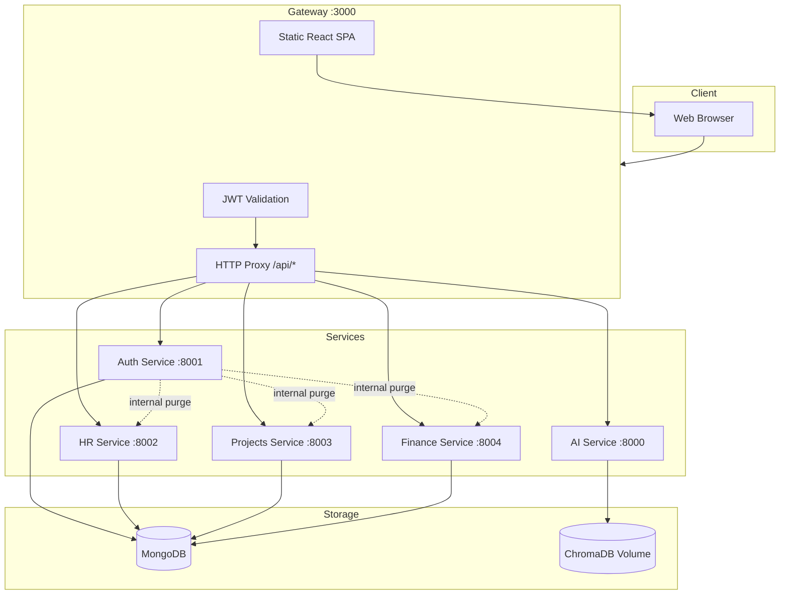
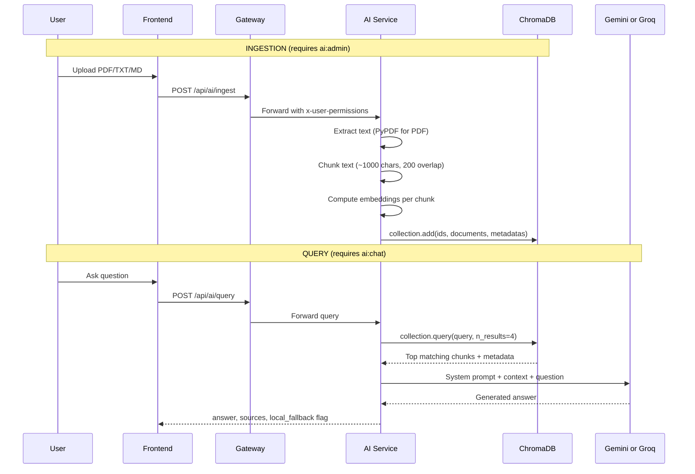
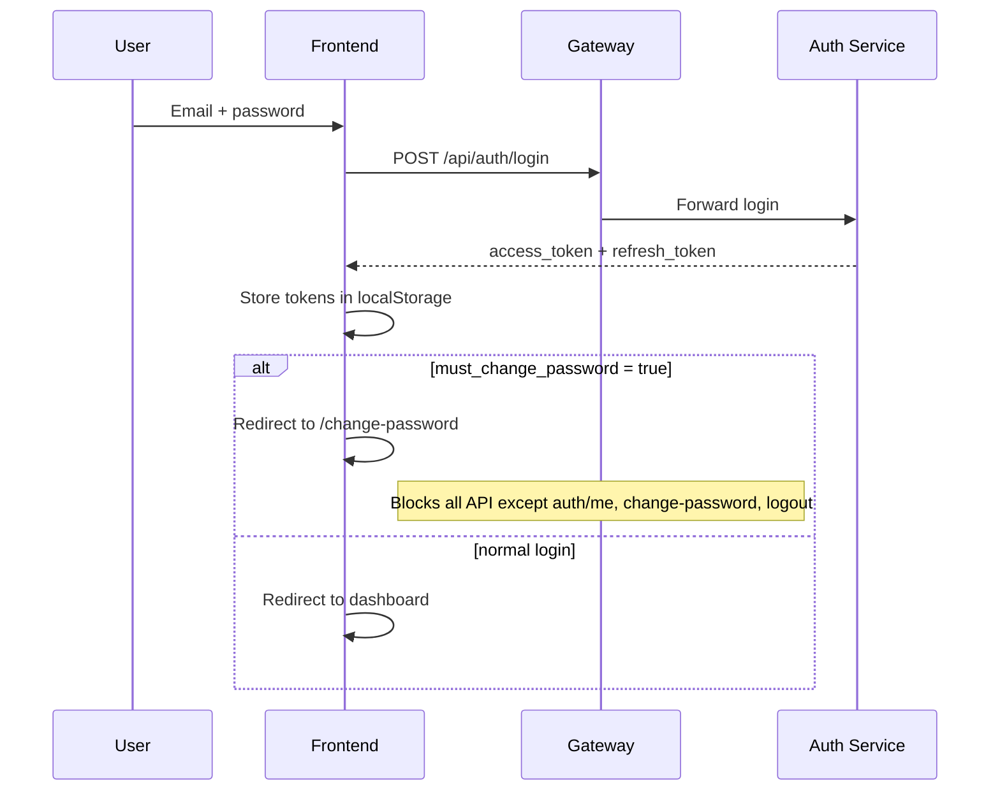

# OrganiStation — Application Documentation

OrganiStation is an enterprise web platform that combines **HR**, **project management**, **finance**, and an **AI document assistant (RAG)** behind a single sign-on experience. The application is built as a **microservices architecture**: a React frontend is served by an API gateway, which routes authenticated requests to specialized backend services.

This document describes **what the application is**, **how it is structured**, **how components interact**, and **how the RAG pipeline works**. It focuses on application design only (not deployment or cloud setup).

---

## Table of Contents

1. [Purpose and Scope](#1-purpose-and-scope)
2. [High-Level Architecture](#2-high-level-architecture)
3. [Technology Stack](#3-technology-stack)
4. [Repository Structure](#4-repository-structure)
5. [Runtime Topology (Docker Compose)](#5-runtime-topology-docker-compose)
6. [API Gateway](#6-api-gateway)
7. [Authentication and Authorization Service](#7-authentication-and-authorization-service)
8. [HR Service](#8-hr-service)
9. [Project Management Service](#9-project-management-service)
10. [Finance Service](#10-finance-service)
11. [AI / RAG Service](#11-ai--rag-service)
12. [Frontend Application](#12-frontend-application)
13. [Security Model](#13-security-model)
14. [User Lifecycle and Data Cascade Delete](#14-user-lifecycle-and-data-cascade-delete)
15. [Complete API Surface (via Gateway)](#15-complete-api-surface-via-gateway)
16. [Data Storage Summary](#16-data-storage-summary)
17. [Known Design Characteristics](#17-known-design-characteristics)

---

## 1. Purpose and Scope

OrganiStation provides a unified portal for organization operations:

| Module | Purpose |
|--------|---------|
| **Dashboard** | Role-aware overview (admin metrics vs employee workspace) |
| **HR & People** | Employee directory, attendance, leave, job postings |
| **Projects** | Projects, tasks, milestones, support tickets |
| **Finance** | Expenses, budgets, invoices, financial summary |
| **AI Assistant** | Chat over uploaded company documents (RAG) |
| **Team Directory** | View all login accounts; manage accounts by role hierarchy |
| **Settings** | User preferences and account settings |

**Design principles:**

- **No public registration** — accounts are created by HR or administrators.
- **Role-based access control (RBAC)** — permissions drive both API access and UI visibility.
- **Hierarchical roles** — users can only create, edit, or delete accounts **below** their rank.
- **Hidden super admin** — `SUPER_ADMIN` accounts are invisible to all other roles.
- **Mandatory first-login password change** — enforced at gateway and auth layers.
- **Cascade delete** — deleting a login account removes related data across HR, projects, and finance.

---

## 2. High-Level Architecture

All user traffic enters through **one port** (gateway `:3000`). The gateway serves the React SPA and proxies `/api/*` to backend services.



**Request flow (typical authenticated API call):**

1. Browser sends `Authorization: Bearer <access_token>` to `http://host:3000/api/...`
2. Gateway validates JWT with shared `JWT_SECRET`
3. Gateway injects headers: `x-user-email`, `x-user-role`, `x-user-permissions`
4. Gateway forwards to the correct microservice with path rewriting
5. Service processes request and returns JSON

---

## 3. Technology Stack

| Layer | Technology |
|-------|------------|
| Frontend | React 18, Vite, React Router, Lucide icons |
| Gateway | Node.js, Express, `http-proxy-middleware`, `jsonwebtoken` |
| Auth / HR / Projects / Finance | Python 3, FastAPI, Motor (async MongoDB) |
| AI Service | Python 3, FastAPI, ChromaDB, PyPDF, Google Generative AI SDK |
| Primary database | MongoDB 7 (separate database per domain service) |
| Vector store | ChromaDB (persistent volume, collection `rag_documents`) |
| Auth tokens | JWT (HS256), access + refresh token rotation |
| Password hashing | bcrypt |

---

## 4. Repository Structure

```
anu-ai/
├── frontend/                    # React SPA source (built into gateway/public)
│   └── src/
│       ├── api/client.js        # All HTTP calls to /api/*
│       ├── context/AuthContext.jsx
│       ├── components/          # AppLayout, ProtectedRoute, CredentialsModal
│       ├── pages/               # Login, Dashboard, HR, Projects, Finance, AI, Users, Settings
│       └── utils/roles.js       # Frontend role hierarchy helpers
│
├── gateway/                     # Express API gateway + static file server
│   ├── src/app.js               # JWT middleware, proxy routing, SPA fallback
│   └── public/                  # Built frontend assets (dist output)
│
├── auth-service/                # Identity, users, roles, JWT
│   └── src/
│       ├── routes/auth.py       # Login, refresh, me, change-password
│       ├── routes/users.py      # CRUD users + cascade delete orchestration
│       ├── routes/roles.py      # Roles and permissions
│       ├── utils/seeder.py      # Default roles, permissions, super admin
│       ├── utils/role_hierarchy.py
│       ├── utils/user_cleanup.py
│       └── utils/auth_deps.py   # get_current_user, PermissionChecker
│
├── ai-service/                  # RAG pipeline + document ingestion
│   └── src/
│       ├── app.py               # FastAPI endpoints
│       ├── rag_pipeline.py      # ChromaDB, chunking, embeddings, LLM query
│       └── permissions.py       # ai:admin gate for ingest/reset/delete
│
├── hr-service/                  # Employees, attendance, leave, jobs
│   └── app.py
│
├── project-management-service/  # Projects, tasks, milestones, tickets
│   └── app.py
│
├── finance-service/             # Expenses, budgets, invoices, summary
│   └── app.py
│
└── docker-compose.yml           # Orchestrates all services + MongoDB + volumes
```

Each backend service is **independently deployable** with its own Dockerfile, requirements, and `.env.example`.

---

## 5. Runtime Topology (Docker Compose)

When running via Docker Compose, these containers exist:

| Service | Container role | Port (internal) | Database / storage |
|---------|----------------|-----------------|-------------------|
| `mongo` | Shared MongoDB | 27017 | Volume `mongo_data` |
| `auth` | Auth + users + roles | 8001 | `organistation_auth` |
| `ai` | RAG service | 8000 | Chroma volume `chroma_data` at `/app/chroma_db` |
| `hr` | HR module | 8002 | `organistation_hr` |
| `projects` | Projects module | 8003 | `organistation_projects` |
| `finance` | Finance module | 8004 | `organistation_finance` |
| `gateway` | Public entry point | **3000** (exposed) | Serves `gateway/public` |

The **only public-facing port** in the default compose file is `3000` on the gateway.

---

## 6. API Gateway

**Location:** `gateway/src/app.js`

### Responsibilities

1. **Serve the React SPA** from `gateway/public/`
2. **Validate JWT** on all `/api/*` routes except public auth endpoints
3. **Enforce first-login password change** — if JWT contains `must_change_password: true`, block all API calls except `/api/auth/me`, `/api/auth/change-password`, `/api/auth/logout`
4. **Proxy** requests to the correct microservice
5. **Rewrite paths** so frontend uses consistent `/api/{service}/...` URLs

### Public routes (no JWT required)

- `POST /api/auth/login`
- `POST /api/auth/register` (returns 403 — registration disabled)
- `POST /api/auth/refresh`
- `GET /api/auth/health`
- `GET /api/health`

### Proxy routing table

| Frontend path prefix | Target service | Rewritten backend path |
|---------------------|----------------|------------------------|
| `/api/auth`, `/api/users`, `/api/roles`, `/api/permissions` | Auth `:8001` | Same path |
| `/api/ai/*` | AI `:8000` | `/api/*` (strip `/ai`) |
| `/api/hr/*` | HR `:8002` | `/api/*` (strip `/hr`) |
| `/api/projects/*`, `/api/tickets/*` | Projects `:8003` | `/api/*` |
| `/api/finance/*` | Finance `:8004` | `/api/*` (strip `/finance`) |

### Headers forwarded to downstream services

After successful JWT validation:

```
x-user-email: <user email from JWT sub>
x-user-role: <role name>
x-user-permissions: ["users:read", "ai:chat", ...]  (JSON string)
```

The AI service reads `x-user-permissions` to enforce `ai:admin` on document upload operations.

---

## 7. Authentication and Authorization Service

**Location:** `auth-service/`  
**Database:** `organistation_auth` (MongoDB)

### Collections

| Collection | Contents |
|------------|----------|
| `users` | Login accounts (email, hashed password, name, role, status, `must_change_password`) |
| `roles` | Role definitions with permission name lists |
| `permissions` | Permission catalog |
| `refresh_tokens` | Active refresh tokens for rotation/logout |

### Startup behavior

On service start:

1. Connect to MongoDB
2. Run `seed_database()` — upserts permissions, syncs role permission lists, creates default super admin if missing

### Auth endpoints

| Method | Path | Description |
|--------|------|-------------|
| POST | `/auth/login` | Returns access + refresh JWT |
| POST | `/auth/refresh` | Rotates refresh token, issues new access token |
| POST | `/auth/logout` | Deletes refresh token from DB |
| GET | `/auth/me` | Current user profile + resolved permissions |
| POST | `/auth/change-password` | Updates password, clears `must_change_password`, returns new access token |
| POST | `/auth/register` | Always **403** — public registration disabled |

### JWT payload (access token)

```json
{
  "sub": "user@company.com",
  "role": "HR_MANAGER",
  "permissions": ["users:read", "hr:write", "ai:chat", "..."],
  "must_change_password": false,
  "exp": 1234567890
}
```

Access tokens expire in **15 minutes** (configurable). Refresh tokens expire in **7 days** and are stored server-side for revocation.

### Users endpoints

| Method | Path | Access |
|--------|------|--------|
| GET | `/users` | Any authenticated user (read-only directory) |
| GET | `/users/{id}` | Authenticated; hidden users return 404 |
| POST | `/users` | `users:write` + hierarchy + creatable role check |
| PUT | `/users/{id}` | Self or admin with hierarchy rules |
| DELETE | `/users/{id}` | `users:write` + hierarchy; triggers **cascade delete** |

New users receive a **generated temporary password** and `must_change_password: true`.

### Roles and permissions

**12 permissions** define granular access:

```
users:read, users:write, roles:read, roles:write,
hr:read, hr:write, projects:read, projects:write,
finance:read, finance:write, ai:chat, ai:admin
```

**6 roles** with default permission mappings (synced on startup):

| Role | Rank | Key capabilities |
|------|------|------------------|
| `SUPER_ADMIN` | 100 | All permissions; hidden from other users |
| `ORG_ADMIN` | 90 | Full org management except super admin operations |
| `HR_MANAGER` | 70 | HR write, user management for employees, AI document upload |
| `PROJECT_MANAGER` | 60 | Projects write, directory read |
| `FINANCE_MANAGER` | 60 | Finance write, directory read |
| `EMPLOYEE` | 10 | Read directory, HR, projects; AI chat only (no upload) |

### Role hierarchy rules

Defined in `auth-service/src/utils/role_hierarchy.py`:

- **`can_manage_role(actor, target)`** — actor rank must be **strictly greater** than target; `SUPER_ADMIN` target is never manageable by others
- **`ROLE_CREATABLE`** — limits which roles each role can assign when creating accounts
- **`is_visible_user`** — `SUPER_ADMIN` users hidden unless viewer is also `SUPER_ADMIN`

---

## 8. HR Service

**Location:** `hr-service/app.py`  
**Database:** `organistation_hr`

### Collections and entities

| Collection | Entity | Key fields |
|------------|--------|------------|
| `employees` | Employee profile | `first_name`, `last_name`, `email`, `department`, `position`, `phone`, `status` |
| `attendance` | Attendance log | `employee_id`, `date`, `check_in`, `check_out`, `status` |
| `leave_requests` | Leave | `employee_id`, `type`, `start_date`, `end_date`, `status` |
| `jobs` | Job postings | `title`, `department`, `description`, `type`, `status` |

### API endpoints

| Method | Path | Description |
|--------|------|-------------|
| GET/POST | `/api/employees` | List / create employees |
| GET/PUT/DELETE | `/api/employees/{id}` | Single employee CRUD |
| GET | `/api/employees/{id}/attendance` | Attendance for employee |
| POST | `/api/attendance` | Log attendance |
| GET/POST | `/api/leaves` | List / create leave requests |
| PUT | `/api/leaves/{id}` | Approve/reject leave |
| GET/POST | `/api/jobs` | Job postings |

### Internal endpoint (service-to-service)

`POST /api/internal/purge-user` — called by auth service when a **login account** is deleted. Removes employee (by email), attendance, and leave records. Protected by `X-Internal-Secret` header.

Deleting an employee via HR UI also cascades attendance and leave for that employee ID.

**Note:** HR employee records and auth user accounts are **linked by email** when both exist, but they are stored in separate databases.

---

## 9. Project Management Service

**Location:** `project-management-service/app.py`  
**Database:** `organistation_projects`

### Collections

| Collection | Entity | Relationships |
|------------|--------|---------------|
| `projects` | Project | `name`, `status`, `priority`, dates, optional `owner` |
| `tasks` | Task | `project_id`, `assignee`, `status`, `priority` |
| `milestones` | Milestone | `project_id`, `title`, `due_date`, `completed` |
| `tickets` | Support ticket | `project_id`, `reporter`, `assignee`, `status` |

### API endpoints

| Method | Path | Description |
|--------|------|-------------|
| GET/POST | `/api/projects` | List / create projects |
| GET/PUT/DELETE | `/api/projects/{id}` | Project CRUD (delete removes tasks) |
| GET/POST | `/api/projects/{id}/tasks` | Tasks within project |
| PUT | `/api/tasks/{id}` | Update task |
| GET/POST | `/api/projects/{id}/milestones` | Milestones |
| GET/POST | `/api/tickets` | Global ticket list / create |
| PUT/DELETE | `/api/tickets/{id}` | Update / delete ticket |

### Internal purge endpoint

When a user account is deleted, auth calls `POST /api/internal/purge-user` which removes:

- Projects where `owner` matches user email or full name
- Tasks where `assignee` matches
- Tickets where `assignee` or `reporter` matches
- All tasks, milestones, and tickets under deleted owned projects

---

## 10. Finance Service

**Location:** `finance-service/app.py`  
**Database:** `organistation_finance`

### Collections

| Collection | Entity | Key fields |
|------------|--------|------------|
| `expenses` | Expense report | `title`, `amount`, `category`, `submitted_by`, `status` |
| `budgets` | Department budget | `department`, `amount`, `period`, `year`, `month` |
| `invoices` | Client invoice | `client_name`, `amount`, `due_date`, `status` |

### API endpoints

| Method | Path | Description |
|--------|------|-------------|
| GET | `/api/summary` | Aggregated revenue, expenses, net balance |
| GET/POST | `/api/expenses` | Expense list / create |
| PUT/DELETE | `/api/expenses/{id}` | Update / delete expense |
| GET/POST | `/api/budgets` | Budget list / create |
| GET/POST | `/api/invoices` | Invoice list / create |
| PUT/DELETE | `/api/invoices/{id}` | Update / delete invoice |

### Internal purge endpoint

Deletes expenses where `submitted_by` matches the deleted user's email or full name.

---

## 11. AI / RAG Service

**Location:** `ai-service/`  
**Vector storage:** ChromaDB persistent client at `CHROMA_DB_PATH` (default `./chroma_db`, Docker: `/app/chroma_db`)  
**Collection name:** `rag_documents`

This is the most specialized module. It implements **Retrieval-Augmented Generation (RAG)**: answers are generated by an LLM using **retrieved document chunks** as context, not from the model's memory alone.

### 11.1 RAG architecture overview



### 11.2 Core class: `RAGPipeline`

**File:** `ai-service/src/rag_pipeline.py`

#### Initialization

On startup, `RAGPipeline`:

1. Creates a **ChromaDB PersistentClient** at `db_path`
2. Gets or creates collection `rag_documents` with cosine similarity (`hnsw:space: cosine`)
3. Selects **LLM provider** based on environment variables:
   - `GROQ_API_KEY` set → Groq `llama-3.3-70b-versatile` for chat
   - Else `GEMINI_API_KEY` set → Google `gemini-1.5-flash` for chat
   - Else → local heuristic fallback (no external LLM)
4. Selects **embedding strategy** via `HybridEmbeddingFunction`:
   - With valid Gemini key (and no Groq override) → `models/text-embedding-004`
   - Without Gemini key → **local hash fallback** (384-dim character n-gram vectors)

**Important behavior:** When `GROQ_API_KEY` is configured, the pipeline currently **disables Gemini embeddings** and uses the local hash fallback for vector search. Groq does not provide an embedding API. Semantic search quality is significantly reduced in this configuration unless a separate embedding provider is used.

#### Document ingestion pipeline

**Method:** `ingest_document(temp_file_path, filename)`

| Step | Action |
|------|--------|
| 1. Extract | `extract_text_from_file()` — PDF via PyPDF, TXT/MD as UTF-8 text |
| 2. Validate | Reject empty documents |
| 3. Chunk | `chunk_text()` — ~1000 character windows, 200 char overlap, split at paragraph/sentence boundaries |
| 4. Hash | `doc_hash = sha256(filename)[:12]` — document ID derived from filename |
| 5. Store | Each chunk stored with ID `{doc_hash}_ch_{i}`, metadata `{filename, chunk_index, doc_hash}` |
| 6. Embed | Chroma calls `HybridEmbeddingFunction` automatically on `collection.add()` |

Supported file types: **`.pdf`**, **`.txt`**, **`.md`**

#### Query pipeline

**Method:** `query(user_query, max_results=4)`

| Step | Action |
|------|--------|
| 1. Retrieve | `collection.query(query_texts=[user_query], n_results=4)` |
| 2. Build context | Join top chunks with source filenames |
| 3. Prompt LLM | System rules: use context, cite sources, note when context is insufficient |
| 4. Return | `{ query, answer, sources[], local_fallback }` |

**Sources** in the response include `filename`, `chunk` index, and `relevance` score (derived from distance).

#### Other RAG operations

| Method | Description |
|--------|-------------|
| `list_documents()` | Aggregates chunks by `doc_hash` → unique files with chunk/character counts |
| `delete_document(doc_hash)` | Deletes all chunks where metadata `doc_hash` matches |
| `reset_database()` | Drops and recreates empty `rag_documents` collection |

### 11.3 AI service API endpoints

| Method | Path | Permission | Description |
|--------|------|------------|-------------|
| GET | `/api/health` | Public via gateway auth | Service status, LLM provider, embedding model |
| GET | `/api/documents` | Authenticated | List ingested documents |
| POST | `/api/ingest` | `ai:admin` (via header) | Upload and index document |
| POST | `/api/query` | Authenticated (`ai:chat` on frontend) | RAG question answering |
| DELETE | `/api/documents/{doc_hash}` | `ai:admin` | Remove one document from index |
| POST | `/api/reset` | `ai:admin` | Clear entire vector collection |

Permission check for admin operations is in `ai-service/src/permissions.py` — reads `x-user-permissions` JSON header from gateway.

### 11.4 Environment variables (AI service)

| Variable | Purpose |
|----------|---------|
| `GEMINI_API_KEY` | Gemini embeddings + optional Gemini chat |
| `GROQ_API_KEY` | Groq Llama chat (overrides Gemini for LLM) |
| `CHROMA_DB_PATH` | Persistent Chroma storage directory |
| `PORT` / `HOST` | Server binding |

### 11.5 RAG quality factors

For accurate answers, these must align:

1. **PDF text extraction** — scanned/image PDFs without text layers produce empty content
2. **Embedding quality** — semantic embeddings (Gemini) retrieve relevant chunks; local hash often retrieves wrong chunks
3. **Re-upload after config change** — changing embedding provider requires reset + re-ingest
4. **Chunk retrieval** — only top 4 chunks are sent to the LLM; if none match, the model falls back to general knowledge

---

## 12. Frontend Application

**Location:** `frontend/`  
**Build output:** copied to `gateway/public/` for production serving

### Routing

| Path | Page | Access |
|------|------|--------|
| `/login` | LoginPage | Public |
| `/change-password` | ChangePasswordPage | Authenticated; forced if `must_change_password` |
| `/` | DashboardPage | Authenticated |
| `/hr` | HRPage | Authenticated (all roles) |
| `/projects` | ProjectsPage | `projects:read` |
| `/finance` | FinancePage | `finance:read` |
| `/ai` | AIPage | `ai:chat` |
| `/users` | UsersPage | Authenticated (read-only for all; write by hierarchy) |
| `/settings` | SettingsPage | Authenticated |

### Key components

| Component | Role |
|-----------|------|
| `AuthContext` | Holds user, permissions, login/logout, `refreshUser()` |
| `ProtectedRoute` | Redirects unauthenticated users to login; enforces password change and optional `requiredPermission` |
| `AppLayout` | Sidebar navigation filtered by permissions; employee vs admin portal labels |
| `CredentialsModal` | Shows auto-generated password after account creation |
| `api/client.js` | Central HTTP layer with JWT refresh on 401 |

### Role-aware UI behavior

- **Employees** see a simplified dashboard and sidebar sections labeled "My Work" / "Directory"
- **Upload / reset on AI page** hidden unless `ai:admin`
- **Team Directory** edit/delete buttons only for users below actor's rank with `users:write`
- **HR page** add/edit/delete only with `hr:write`
- **Super admin** hidden from lists unless viewer is super admin

### API client pattern

All requests go to relative `/api/...` (same origin as gateway). The client:

1. Attaches `Authorization: Bearer` header
2. On 401, attempts token refresh via `/api/auth/refresh`
3. Parses FastAPI error `detail` fields into readable messages

---

## 13. Security Model

### Authentication flow



### Authorization layers

| Layer | Mechanism |
|-------|-----------|
| Gateway | JWT validation; password-change gate; injects permission headers |
| Auth service | `PermissionChecker`, role hierarchy on user CRUD |
| AI service | `ai:admin` header check on ingest/reset/delete |
| Frontend | `ProtectedRoute`, `hasPermission()`, `canManageUser()` |

### Internal service authentication

Cascade delete calls use `POST /api/internal/purge-user` with header:

```
X-Internal-Secret: <INTERNAL_SERVICE_SECRET>
```

These endpoints are **not** exposed through special gateway routes; auth service calls HR/projects/finance **directly on the Docker network**.

---

## 14. User Lifecycle and Data Cascade Delete

### Creating a user

1. Admin/HR with `users:write` creates account via Team Directory or HR flow
2. Auth generates temporary password, sets `must_change_password: true`
3. Optional: HR flow also creates matching employee record with same email
4. Credentials modal displays one-time password for handoff

### First login

1. User logs in → JWT includes `must_change_password: true`
2. Frontend redirects to `/change-password`
3. Gateway blocks all other API usage until password changed
4. After change, new access token issued with flag cleared

### Deleting a user

**Trigger:** `DELETE /users/{id}` in auth service

**Order of operations:**

1. Validate hierarchy and visibility rules
2. `purge_user_data(user)`:
   - Delete refresh tokens for email
   - POST purge to HR service (employee, attendance, leaves)
   - POST purge to projects service (owned projects, assigned tasks/tickets)
   - POST purge to finance service (submitted expenses)
3. Delete user document from `users` collection

---

## 15. Complete API Surface (via Gateway)

All paths are prefixed with `http://<host>:3000`.

### Auth

```
POST   /api/auth/login
POST   /api/auth/refresh
POST   /api/auth/logout
GET    /api/auth/me
POST   /api/auth/change-password
POST   /api/auth/register          → 403 disabled
```

### Users & roles

```
GET    /api/users
POST   /api/users
GET    /api/users/{id}
PUT    /api/users/{id}
DELETE /api/users/{id}
GET    /api/roles
GET    /api/permissions
```

### AI

```
GET    /api/ai/health
GET    /api/ai/documents
POST   /api/ai/ingest              multipart file upload
POST   /api/ai/query               { "query": "..." }
DELETE /api/ai/documents/{doc_hash}
POST   /api/ai/reset
```

### HR

```
GET    /api/hr/employees
POST   /api/hr/employees
GET    /api/hr/employees/{id}
PUT    /api/hr/employees/{id}
DELETE /api/hr/employees/{id}
GET    /api/hr/employees/{id}/attendance
POST   /api/hr/attendance
GET    /api/hr/leaves
POST   /api/hr/leaves
PUT    /api/hr/leaves/{id}
GET    /api/hr/jobs
POST   /api/hr/jobs
```

### Projects

```
GET    /api/projects/projects
POST   /api/projects/projects
GET    /api/projects/projects/{id}
PUT    /api/projects/projects/{id}
DELETE /api/projects/projects/{id}
GET    /api/projects/projects/{id}/tasks
POST   /api/projects/projects/{id}/tasks
PUT    /api/projects/tasks/{id}
GET    /api/projects/projects/{id}/milestones
POST   /api/projects/projects/{id}/milestones
GET    /api/projects/tickets
POST   /api/projects/tickets
PUT    /api/projects/tickets/{id}
DELETE /api/projects/tickets/{id}
```

### Finance

```
GET    /api/finance/summary
GET    /api/finance/expenses
POST   /api/finance/expenses
PUT    /api/finance/expenses/{id}
DELETE /api/finance/expenses/{id}
GET    /api/finance/budgets
POST   /api/finance/budgets
GET    /api/finance/invoices
POST   /api/finance/invoices
PUT    /api/finance/invoices/{id}
DELETE /api/finance/invoices/{id}
```

---

## 16. Data Storage Summary

| Store | Used by | Persistence |
|-------|---------|-------------|
| MongoDB `organistation_auth` | Auth | Docker volume `mongo_data` |
| MongoDB `organistation_hr` | HR | Docker volume `mongo_data` |
| MongoDB `organistation_projects` | Projects | Docker volume `mongo_data` |
| MongoDB `organistation_finance` | Finance | Docker volume `mongo_data` |
| ChromaDB `/app/chroma_db` | AI | Docker volume `chroma_data` |
| Browser `localStorage` | Frontend | `access_token`, `refresh_token` |

HR, projects, and finance services **do not share collections** — cross-module consistency for user deletion is handled by auth orchestration, not foreign keys.

---

## 17. Known Design Characteristics

These are intentional or current implementation traits useful for developers:

1. **Separate databases per service** — classic microservice data isolation; no cross-DB transactions on user delete (best-effort HTTP purge calls).

2. **Email as cross-service identifier** — HR employees and auth users link by email string, not shared UUID.

3. **Gateway is the single auth enforcement point** for external clients; HR/projects/finance trust injected headers but do not re-validate JWT themselves.

4. **Groq + embeddings** — Groq powers chat only; vector search falls back to local hash unless Gemini key is used for embeddings (see RAG section).

5. **Document IDs from filename** — re-uploading the same filename creates duplicate chunk IDs and may cause Chroma conflicts; delete or reset before re-uploading same name.

6. **Public registration disabled** — all accounts provisioned internally.

7. **Super admin seeded once** — default account created on first auth service startup if not present (`admin@organistation.com`).

---

*OrganiStation Application Documentation — describes the codebase architecture and behavior as implemented in this repository.*
